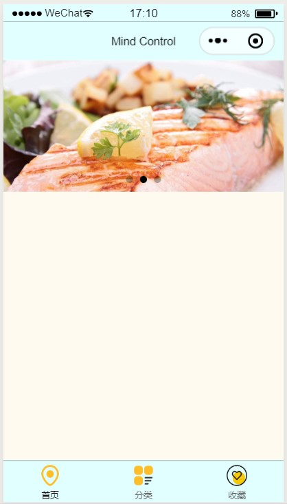

summary: demo
id: 20200211-03-吴怡辰
categories: wechat
tags: 
status: Published 
authors: 吴怡辰
Feedback Link: http://www.sctu.edu.cn
# 轮播图
## 问题描述
微信小程序怎样创建轮播图？
实现图片轮播需要用到什么组件？
## 效果图

## 解决步骤
### swiper组件
在创建轮播图时，必须要使用swiper组件来实现，在写这个标签中还需加入indicator-dots属性，以用于覆盖组件默认样式，自定义样式；同时还需跟一个block标签，以添加控制属性wx:for,wx:key。wxml代码如下：
```
<swiper class="" indicator-dots="true" autoplay="true" interval="5000" duration="1000">
  <block wx:for="{{picList}}" wx:key="index">
    <swiper-item>
      <image src="{{item}}" class="slide-image" mode="aspectFill" bindtap='previewImg' data-previewurl='{{picList}}'
      data-currenturl='{{item}}'/>
    </swiper-item>   
  </block>  
</swiper>

```
### js配置
在js中，需要添加previewImg条件函数，用于添加图片链接。
```
Page({
  data: {
 
  },
 
  //预览图片
  previewImg: function (e) {
    var currentUrl = e.currentTarget.dataset.currenturl
    var previewUrls = e.currentTarget.dataset.previewurl
    wx.previewImage({
      current: currentUrl, //必须是http图片，本地图片无效
      urls: previewUrls, //必须是http图片，本地图片无效
    })
  },
```
## 总结
合理使用swiper组件，swiper千万不要在外面加上任何标签，例如 view 之类的，如果加了可能会导致轮播图出不来。