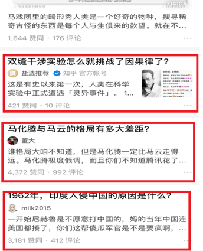
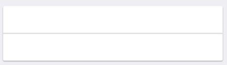
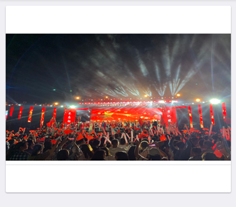
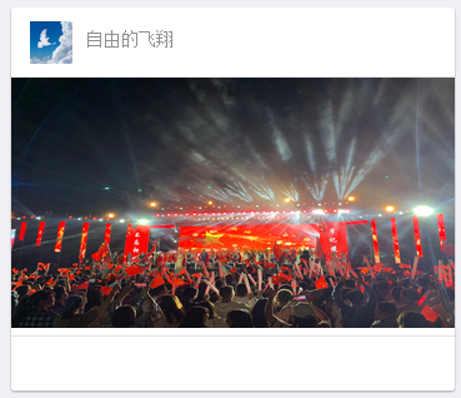
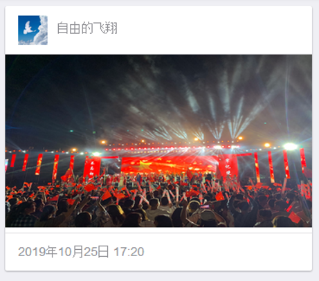
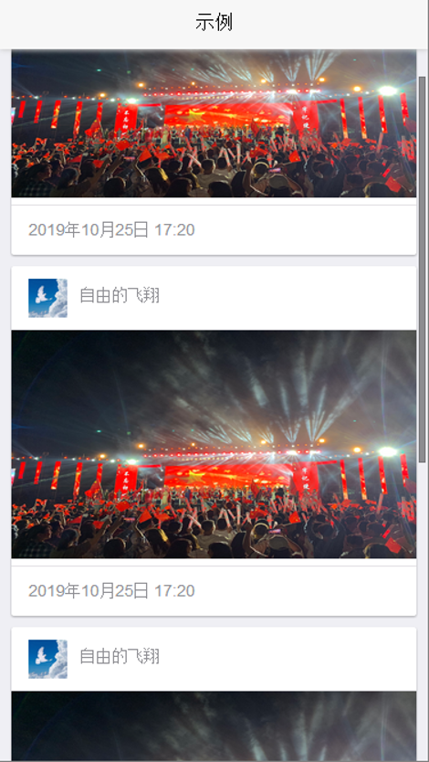

summary: demo
id: 20200211-03-李劲潮
categories:
tags:
status: Published
authors: 李劲潮
Feedback Link: http://www.sctu.edu.cn

# MUI框架 | CardView

## CardView 介绍

在使用MUI开发APP的过程中，功能的融合和美观的布局，往往能使得项目得以顺利进展。不错的设计肯定离不开MUI的各个控件。对于每个控件的熟悉，并且能个灵活的运用，使得多个控件能够自由组合，和谐的互相锲合，常常可以使得写出一个页面有事半功倍的效果。

在本例中，我将介绍如何使用MUI现成样式做一个卡片视图。首先，大家是否明白卡片视图是什么？我们不妨看看下面这张图。不难看出在这个页面中，有三张完整的卡片模块，其实，CardView就是若干个卡片模块的集合。在同一个CardView中的所有卡片大致主题样式应该相似，卡片内容上的布局也应该保持统一性。这两点也是约定熟成的一项要求。



## 分步实现

想必，大家对CradView已经有了整体的了解。接下来，我们就开始通过代码具体实现一个CradView。万事第一步，先搭一个框架，咱们也不例外。

### Card 框架

``` html	
    <!--这是一个卡片的框架-->
	<div class="mui-card">
		<div class="mui-card-header">
			<!--这里是卡片标题-->
		</div>
		<div class="mui-card-content">
			<!--这里是卡片内容-->
		</div>
		<div class="mui-card-footer">
			<!--这里是卡片的底部说明-->
		</div>
	</div>
```



### 填充内容

为了更加清楚的表现出Card模块的各个部分的用途，咱们分别来向这个Crad框架里填充一些内容。首先，我们向content里加入一张展示用的图片。

``` html
    <div class="mui-card-content">
		<!--这里是卡片内容-->
		
	</div>
```

这样我们就得到了一张发帖所展示的封面图。效果如下：



### 完善

- 常见的card的布局，会在header块里展示作者及头像等信息。我们同样，也对我们的header进行完善。

``` html
    <div class="mui-card-header">
		<!--这里是卡片标题-->
			
			<p style="padding-right: 210px; padding-top: 5px;">自由的飞翔</p>
	</div>
```



- 此时，我们的发帖人信息已经做好了完善。紧接着，我们将底部完善好，填充进去发表时间。这样一个卡片就做好了。

``` html			
    <div class="mui-card-footer" style="height: 30px;">
		<!--这里是卡片的底部说明-->
		<div class="mui-media-body" style="padding-top: 10px;">
			<p>2019年10月25日 17:20</p>
		</div>
	</div>
```

 

### 形成 View

我们再多做几个卡片，一个CardView就做好了。最后的效果图如下： 



## 结语

在写页面时，熟练的自由组合各个控件，不用自己写样式，也能写出一个很好看、可以直接使用的页面。当然，对于一些细节上的修改，可以打开mui的css文件进行样式修改。
