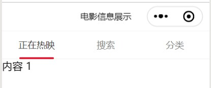

summary: demo
id: 20200211-04-吴怡辰
categories: wechat
tags: 
status: Published 
authors: 吴怡辰
Feedback Link: http://www.sctu.edu.cn
# 顶部导航标签栏
## 问题描述
当我们在一个小程序中想要查看某些信息，总是以页面顶部的一个导航栏展示出来，点击该导航栏上的各个标签则会出现对应页面内容。而如何实现顶部的标签导航栏，并展示其中内容呢？
## 效果图

## 解决步骤
### 引入组件
在json中引入tab组件。
```
{
  "usingComponents": {
    "van-tab": "/dist/tab/index",
    "van-tabs": "/dist/tabs/index"
  }
}

```
### van-tabs配置主页
在van-tabs标签中加入bind:change事件；通过active设定当前激活标签对应的索引值，默认情况下启用第一个标签。wxml代码如下：
```
<van-tabs active="{{ active }}" bind:change="onChange">
  <van-tab title="正在热映">内容 1</van-tab>
  <van-tab title="搜索">内容 2</van-tab>
  <van-tab title="分类">内容 3</van-tab>
</van-tabs>

```
### js配置
在js中，配置onChange条件函数。
```
Page({
  data: {
    active: 1
  },

  onChange(event) {
    wx.showToast({
      title: `切换到标签 ${event.detail.name}`,
      icon: 'none'
    });
  }
})

```
## 总结
在设置一个信息展示页面时，用顶部标签导航让我们的页面跳转更便捷。同样我们可以在页面中设置我们需要的内容。