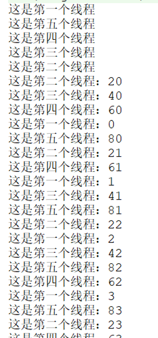

summary: demo
id: 20200211-04-李劲潮
categories:java
tags:
status: Published
authors: 李劲潮
Feedback Link: http://www.sctu.edu.cn

# Java|一个实例了解多线程技术

## 问题描述

在平时的项目中，往往会遇到任务量庞大的时候，这时如果跑一个程序，必然会消耗掉大量的时间。为此拖慢了整体进度。那么有没有什么好的解决办法呢？

## 解决方案

本文即将谈到的多线程技术能够很好的解决该问题。多线程技术就是团队的力量。假如这个时候我们要打印一百个项目编号。

### 常规方法

其中最普通的办法就是直接打印。

``` java
public class Boke {
    public static void main(String[] args) {
        for (int i = 0; i < 100; i++){
            System.out.println("打印结果是：" + i);
        }
    }
}

输出结果是：
打印结果是：0
打印结果是：1
打印结果是：2
打印结果是：3
打印结果是：4
打印结果是：5
············
打印结果是：95
打印结果是：96
打印结果是：97
打印结果是：98
打印结果是：99
```

100个项目编号我能直接打印，如果是1W个呢？10W个呢？这是效率很低的一件事，是对资源的一种浪费。
这时，我们使用多线程技术来解决这个问题，将会为我们提供很大的方便。假如一个任务需要100天完成，我们将其分为5组，同时运行，就只要20天。这就是多线程的魅力。

### 单线程

首先，我们可以将整体分成五个部分，每个部分打印20个，然后，各部分同时运行，最后再进行汇总输出。
我们先写一个线程：

``` java
public class Ex_01 extends Thread {
    @Override
    public void run() {
            System.out.println("这是第一个线程");
            for (int i = 0; i < 20; i++){
                System.out.println(“这是第一个线程：” + i);
            }
        }
}
```

### 线程本质

通过上面的代码，我们不难看出，一个线程的本质，其实就是一个类。我们让Ex_01这个类继承jdk中的Thread类后，Ex_01类就是本次程序多线程中的一个线程了。同理，我们再写出其他几个线程。其余四个线程分别为：Ex_03类、Ex_04类、Ex_05类、Ex_06类。

### 多线程技术

当几个线程都写好后，怎么启用我们所写的这几个线程呢？这时，我们再new一个Ex_02类作为启用类。在这个类中，我们需要将已经写好了的几个线程实例化后，并开始运行他们。

``` java
public class Ex_02 {
public static void main(String[] args) {
//实例化
        Ex_01 ex_01 = new Ex_01();
        Ex_03 ex_03 = new Ex_03();
        Ex_04 ex_04 = new Ex_04();
        Ex_05 ex_05 = new Ex_05();
        Ex_06 ex_06 = new Ex_06();
        //开始运行
        ex_01.start();
        ex_03.start();
        ex_04.start();
        ex_05.start();
        ex_06.start();
    }
}
```

输出结果：


这就是使用多线程技术的一种方式。对于多线程技术，还有着更多的实际用途，其中结合线程的属性，能够使得多线程技术为很多问题提供解决方案。给线程加上一个Threa.sleep()，我们就可以让被设置了的线程在指定的时间进行间隔运行。

## 结语

多线程技术你大概了解了吗？希望读者在进行了深入的学习后，该技术是编程必不可少的！
