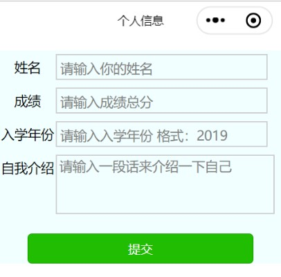
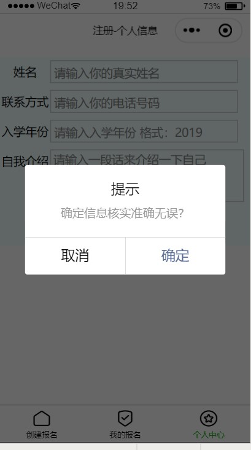

summary: demo
id: 20200211-05-吴怡辰
categories: wechat
tags: 
status: Published 
authors: 吴怡辰
Feedback Link: http://www.sctu.edu.cn
# 表单数据绑定
## 问题描述
一个小程序应用，总是会出现注册时填写个人界面的情况，这个界面就是一个双向数据绑定的表单。
那么如何实现这样一个表单？一个表单如何进行数据绑定？表单需要提交信息时弹出的提示弹窗是如何实现的？
## 效果图


## 解决步骤
### 制作表单
制作表单时，先是用一个form标签对整体表单进行一个基础配置，然后给view标签不同的类名设置wxss样式。需要对表单填写时，通常运用<input> placeholder属性，来规定可描述输入字段预期值的简短的提示信息。如以下代码中，在填写“姓名”的文本框里面会出现提示信息“请输入你的姓名”。如果要改变聚焦时光标离软键盘的距离，可以用一个微信小程序特有的cursor-spacing属性。wxml代码如下：
```
<view class='input_w professional'>
<text class='left'>姓名</text>
<view class='input left'>
<input placeholder='请输入你的真实姓名' cursor-spacing='20' name='name'></input>
</view>
</view>

```
### 提示弹窗
信息填写完之后，提交时总是会跳出一个提示框，问你是否确定信息准确无误，这就需要一个button标签设置一个按钮用来开启提交事件，然后需要设置一个formType属性用于向服务器发送表单数据。
wxml代码如下：
```
<button class='sub' formType="submit" bindtap="modalcnt">提交</button>
```
js数据绑定,用modalcnt: function()条件函数，代码如下：
```
modalcnt: function () {
    wx.showModal({
      title: '提示',
      content: '确定信息核实准确无误？',
      success: function (res) {
        if (res.confirm) {
          console.log('用户点击确定')
        } else if (res.cancel) {
          console.log('用户点击取消')
        }
      }
    })	
  }  

```
## 总结
在添加一个form标签时，form必须有提交事件，如bindsubmit="back"。
设置一个文本框时，如果填写内容需要输入多行，需要使用一个textarea标签。
