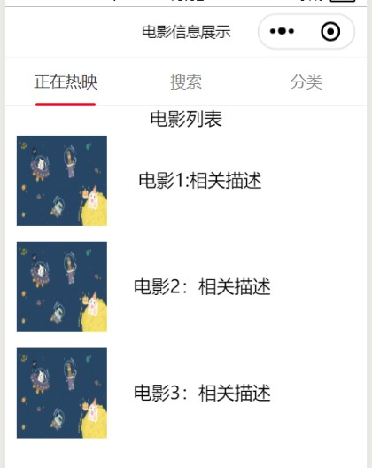
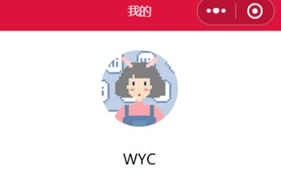

summary: demo
id: 20200211-06-吴怡辰
categories: wechat
tags: 
status: Published 
authors: 吴怡辰
Feedback Link: http://www.sctu.edu.cn
# 基础图文排版
## 问题描述
图文排版有多种形式，接下来介绍两种最基础类型的图文排版：左图右字和上图下字。
## 左图右字
### 效果图

图文组合时，要让左边是图，右边是文字描述，需要将图片image标签和文字标签（注：此时使用view标签）放进同一个view标签里面,再对wxss进行配置。
### wxml代码如下：
```
<view class="v1">电影列表</view>
  <view>
    <image class="p1" src="/pages/image/timg.jpg"></image>
    <view class="t1">电影1:相关描述</view>
  </view>
  <view>
    <image class="p2" src="/pages/image/timg.jpg"></image>
    <view class="t2">电影2：相关描述</view>
  </view>
    <view>
    <image class="p2" src="/pages/image/timg.jpg"></image>
    <view class="t2">电影3：相关描述</view>
  </view>

```
### wxss代码如下：
```
.p1{
  margin: 5px 10px;
  height: 80px;
  width: 80px;
}

.t1{
  margin-right: 220rpx;
  margin-top: 80rpx;
  float: right
}

.p2{
  margin: 5px 10px;
  height: 80px;
  width: 80px;
}

.t2{
  margin-right: 200rpx;
  margin-top: 80rpx;
  float: right
}

```
## 上图下字
### 效果图

上图下字与左图右字的wxml配置方法类似，都是放入同一个view中再进行配置，重点是在wxss中的不同。
### wxml代码：
```
<view>
  <view class="v1">
    <navigator url="/pages/change/change">
     <image class="touxiang" src="/images/touxiang.jpg"></image>
    </navigator>
  </view>
  <view class="v1">
   <text>WYC</text>
  </view>
</view>
<view class="partitionLine"></view>
```
### wxss中的代码：
```
.v1{
  display: flex;
  flex-direction: column;
  align-items: center;
}

.touxiang{
  margin: 50rpx;
  height: 200rpx;
  width: 200rpx;
  border-radius: 50%;
}

```
## 总结
无论是哪种图文排版形式，最重要的就是将图片和文字放入同一个view标签中，再在wxss中调整不同的位置和大小。