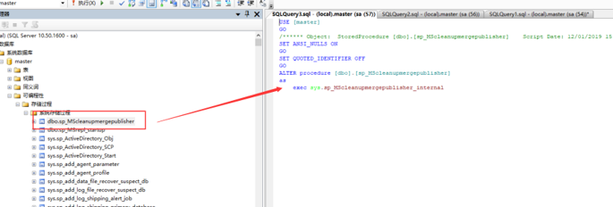

summary: demo
id: 20200211-07-李劲潮
categories: flutter
tags: sctu-db
status: Published
authors: 李劲潮
Feedback Link: http://www.sctu.edu.cn

# DB | 存储过程的管理

## 存储过程的介绍

存储过程是由一系列Transact-SQL语句组成的程序，它们经过编译后保存在数据库中。因此存储过程比普通Transact-SQL语句执行更快，且可以多次调用。在SQL Server中包含的存储过程类型主要包括:系统存储过程和用户定义存储过程。
格式各样的存储过程非常的多，并且具有类似功能的存储过程也不只有一两个。如果每次要用的时候，又去创建新的存储过程，是对资源的一种浪费。因此，学会管理存储过程就显得尤为的重要。同样，存储过程与表、视图以及关系图这些数据库对象一样，在创建之后可以根据需求对它进行修改和删除操作。

## 查看存储过程

对于现成的存储过程，我们有几种方法可以对该过程的信息进行查看。（我们以命名为A的存储过程为例）


``` SQL
Sp_helptext A // 查看文本信息
Exec sp_help A // 查看基本信息
Exec sp_depends A // 查看详细信息
```

以上是通过语句来查看存储过程，当然对于SQL Server来说，可以直接通过对象资源管理器来查看。具体方法如图：

 

这样就可以查看到相应数据库的存储过程。

## 修改存储过程

接下来就看看怎么修改存储过程吧。在SQL Server 2008中通常使用ALTER PROCEDURE语句修改存储过程。

``` SQL
ALTER PROCEDURE procedure_name [;number ]
[{@parameter data type)
[VARYING][=default] [OUTPUPT]]
[,…n]
[WITH
{RECOMPILE | ENCRYPTION | RECOMPILE,ENCRYPTION}]
[FOR REPLICATION]
AS
sql_ statement[…n]
```

当然，在SQL Server 2008中我们还是可以直接在对象资源管理器中修改。



## 删除存储过程

删除存储过程就非常的简单，但是在删除之前应该先执行sp_depends存储过程来确定是否有对象依赖于此存储过程。
删除语句如下：

``` SQL
Drop procedure {procedure}[…n]
```

当然在SQL Server 2008中，直接鼠标点击删除就可以了。

## 结语

本例讲解了存储过程的基本操作，深入的学习需要多多练习，多使用SQL语句，不要偷懒用可视化工具。管理好数据库存储过程，往往会有事半功倍的效果！
