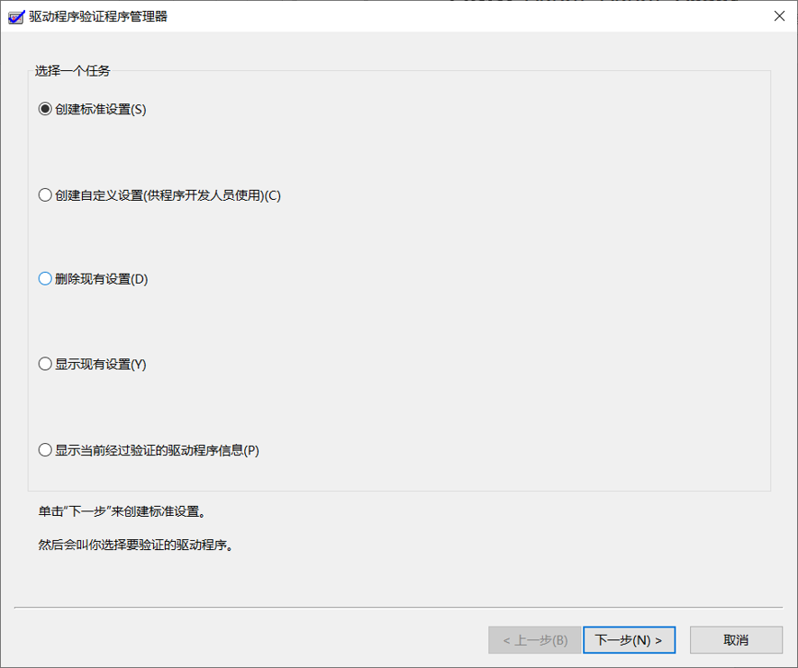
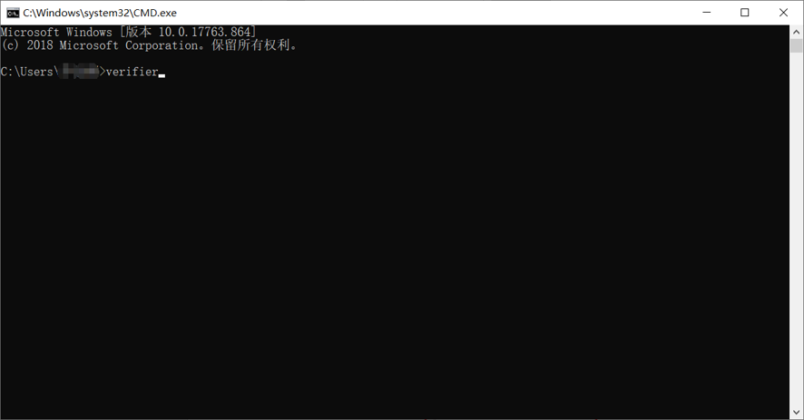
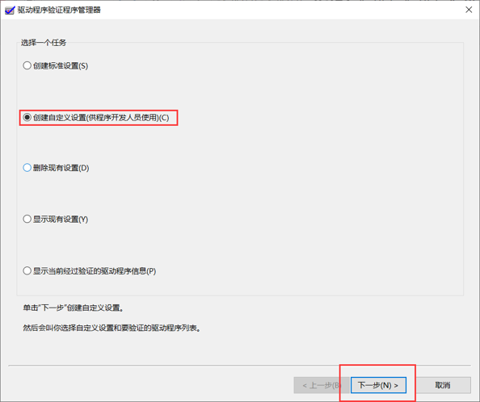
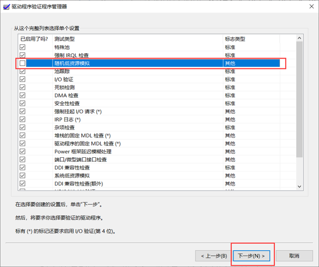
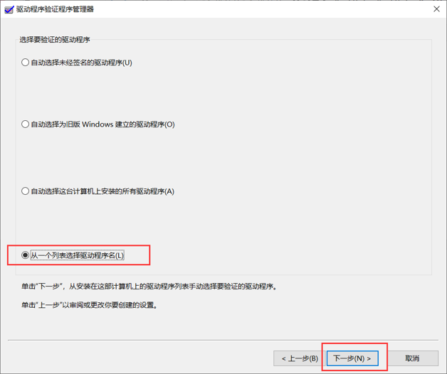
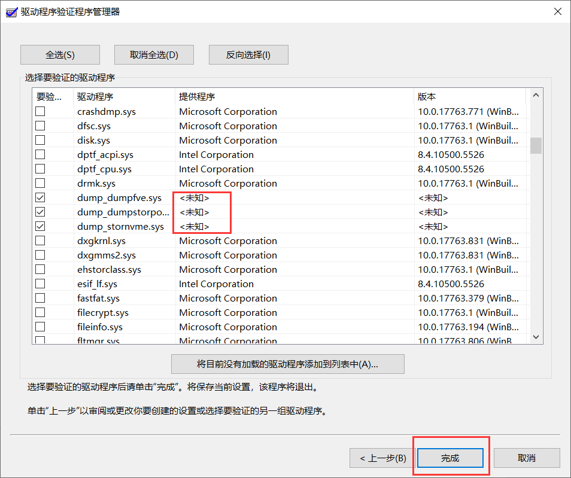

summary: demo
id: 20200211-8-李劲潮
categories: security
tags:
status: Published
authors: 李劲潮
Feedback Link: http://www.sctu.edu.cn

# verifier工具的使用

## 问题简述

在平时使用电脑的过程中，或多或少的会遇到一些问题？最让你头疼的是什么问题呢？我猜那一定就是蓝屏问题了吧。经常事先不给你打任何招呼，蓝屏他就这么突然的袭来。他来时，你正在写这代码；他来时，你正在画着图；他来时你正在打着游戏。你是不是非常的讨厌他？今天，我就教你一招，消灭蓝屏，让你不再怕他。

## 问题分析

引起电脑蓝屏的因素很多，比如：软硬件不兼容、电脑温度过高、中病毒和驱动程序未正常驱动等等。随着时代的发展，人们在计算机安全方面的意思也是越来越高，防火墙和杀毒软件俨然已经成了人们计算机上不可少的一部分；电脑的制造工艺也越来越好，散热更是可靠。导致现在出现蓝屏情况，大概率的问题是驱动出现异常。比如：Bad_pool_caller错误（死亡蓝屏）。其实，在很多情况下，都是由于驱动异常导致的。

## 解决方案

接下来，我给大家介绍一个工具。来解决因为驱动异常导致的蓝屏。这款工具就是微软自带的verifier（驱动程序验证程序管理器）。

这是一款在高压环境下检验各个驱动程序运行情况的一个工具。在一个高压的情况下，当任何一个驱动程序出现问题，导致出现蓝屏。我们都可以根据蓝屏提示信息找到相应的驱动程序，进行删除或者更新。从而解决蓝屏问题。

## 解决步骤

### 这个工具是怎么操作的呢？别急，我们完成下面三步，就能够使用verifier了。

- 第一步：同时按win + R调出窗口，在窗口中输入cmd，打开cmd命令窗口，并输入verifier,敲击回车。

 

- 第二步：在进入了verifier界面后，我们选择第二个单选框，并点击下一步。
  
 

- 第三步：我们勾选除了除“随机低资源模拟”其他全部的测试类型。点击下一步。
  
 

- 第四步：我们选择最后一个单选框，点击下一步。

 

- 第五步：因为微软自己的驱动程序很少出现问题，所以为了节省时间，大家可以只勾选由<未知>提供程序的驱动程序来进行验证。当然全选也是没有问题的。
- 
 

在点击完成后，会提示必须重新启动电脑后，才能生效，这是自己手动重新启动就可以了。

## 注意事项

在文章的结尾，有个很重要的事要提醒大家，在做verifier验证之前，__最好备份一下系统或者创建一个系统还原点__，以方便出现问题进行系统恢复。由于驱动程序没有抗住而无限蓝屏时，就进入安全模式，然后再次运行verifier,选择删除现有设置，再次重启就好了。检测完毕后，也最好关闭检测任务。