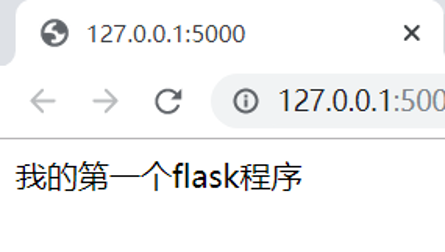
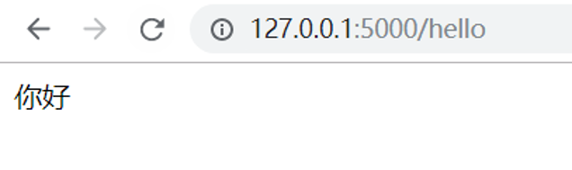

# 我的第一个Flask程序

## Flask介绍

Flask是目前十分流行的web框架，采用Python编程语言来实现相关功能。它被称为微框架(microframework)，“```微```”并不是意味着把整个Web应用放入到一个Python文件，微框架中的“微”是指Flask旨在保持代码简洁且易于扩展，Flask框架的主要特征是核心构成比较简单，但具有很强的扩展性和兼容性，程序员可以使用Python语言快速实现一个网站或Web服务。

##   Hello Flask

一个最小的Flask应用如下：
```python
from flask import Flask
app = Flask(__name__)

@app.route('/')
def hello_world():
return 'Hello,Flask!'
if __name__=='__main__':
    app.run()


```

首先我们导入了Flask类，接着我们创建了这个类的实例，第一个参数应该是模块或包的名称，如果使用一个单一模块，就该使用__name__，然后使用route()装饰器来告诉Flask触发函数的URL。最后保存的时候不要用Flask.py作为应用名称，因为这样会与Flask本身发生冲突。

最后运行，这样就启动了一个非常简单的内建的服务器。在浏览器地址栏输入```http://127.0.0.1:5000/```就能看见Flask字样了



现在Web应用都是用有意义的URL，这样能帮助人们记住，提高回头率。我们可以使用route()装饰器来把函数绑定到URL：
```python
@app.route('/')
def index():
    return 'Index Page'

@app.route('/hello')
def hello():
    return 'Hello, World'

```

在地址栏输入```http://127.0.0.1:5000/hello```就会出现如下界面：



## 最后


Flask 很轻，花很少的成本就能够开发一个简单的网站。非常适合初学者学习。Flask 框架学会以后，可以考虑学习插件的使用。例如使用 WTForm + Flask-WTForm 来验证表单数据，用 ```SQLAlchemy + Flask-SQLAlchemy``` 来对你的数据库进行控制。