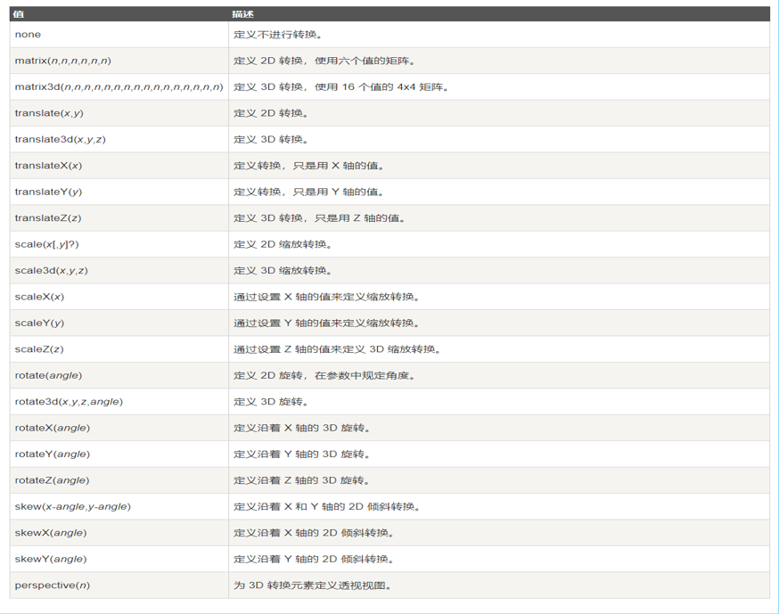
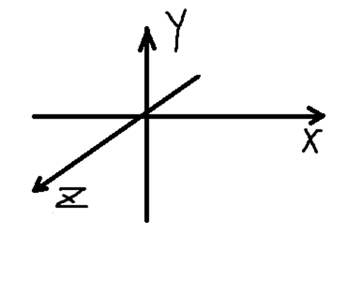
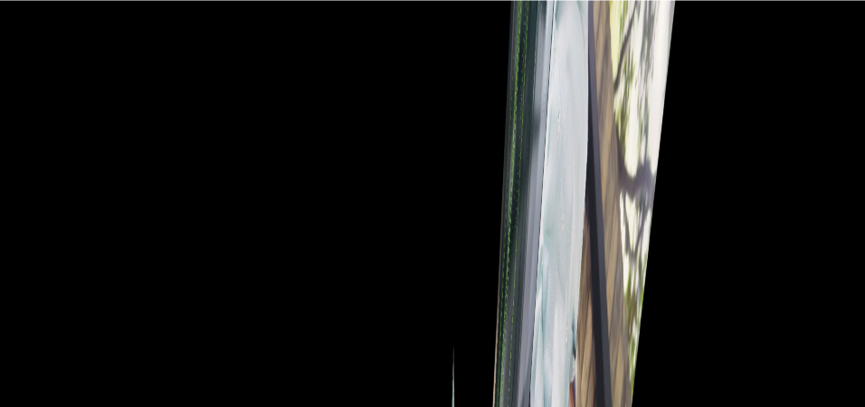
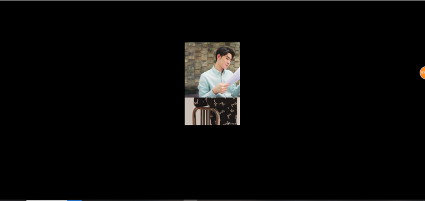
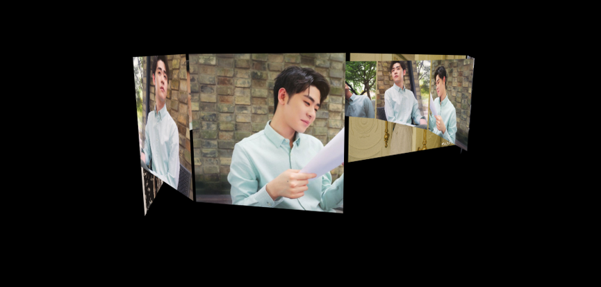
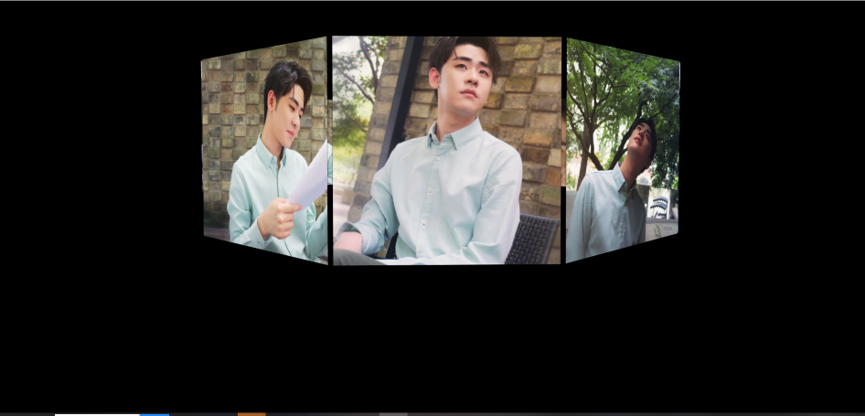
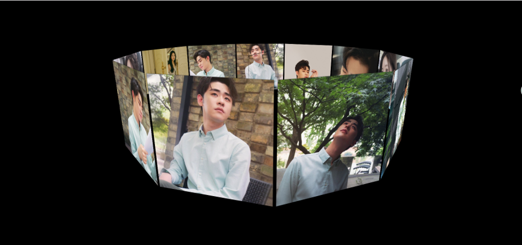

summary: demo
id: 20200212-02-杨金月
0ries: webpage
tags: 
status: Published 
authors: 杨金月
Feedback Link: http://www.sctu.edu.cn

# JS实现3D旋转相册
3D旋转相册是通过perspective属性的盒子1产生向网页内部的延伸感，并让装有图片沿z轴平移后的盒子2在拥有perspective属性的盒子1内凭借transform属性产生的3d效果沿盒子2y轴旋转转动来实现的。
## 1.属性介绍
### 1)	perspective属性：
多少像素的3D元素是从视图的perspective属性定义。这个属性允许你改变3D元素是怎样查看透视图。定义时的perspective属性，它是一个元素的子元素，透视图，而不是元素本身。
注意：perspective 属性只影响 3D 转换元素。
### 2)	transform属性：
应用于元素的2D或3D转换。这个属性允许你将元素旋转，缩放，移动，倾斜等。
语法：
```js
transform: none|transform-functions
```

transform中的x、y、z、轴的含义如图所示：

## 2.实现方法
1)	设置一个div，为其加上perspective的属性(撑开空间)，方便后边观察效果
```css
#perspective{
	perspective: 700px;
}/*此属性是实现旋转木马的要点，能产生空间上的距离/延伸感。在此盒子中放置图片的盒子便可以实现向网页内部延伸的感觉*/

```

 2)	设置装有图片盒子的容器wrap,使其居中显示，并加上position:relative的属性，让其内的图片定位。并加上transform属性。
```css
#wrap{
	position: relative;
	width: 200px;
	height: 200px;
	margin: 150px  auto;
	border:  1px solid black;
	transform-style: preserve-3d;  /*实现3d效果的关键步骤，与boxshadow配合使用可以忽略层级问题，之后会说到*/
	transform: rotateX(0deg) rotateY(0deg) ;//为盒子的3d效果和旋转效果做准备。
}
```
3)	加入图片，设置样式，使用position:absolute；使其重叠。以数组的形式获取，并根据其数组长度length来计算图片的旋转角度。
```css
#wrap img{
	position: absolute;
	width: 200px;
}
```
```html
<script>
    var oImg = document.getElementsByTagName('img')；
    var Deg = 360/oImg.length; 
    oWrap = document.getElementById('wrap');  /*顺便拿一下容器*/
</script>

```
4)	遍历数组，使其沿y轴旋转Deg度。此处使用了原型，使用foreach方法遍历了数组，让其内每个图片都执行了function(el,index)。使用index下标区分开了数组内每个图片需要旋转的不同度数（第一张0°（Deg * 0） 第二张Deg度 （Deg * 1） 第三张（Deg * 2）度…）
```js
/*oImg表示数组对象，function(el,index)表示数组内每个对象要执行的函数，index为其下标。*/
Array.prototype.forEach.call(oImg,function(el,index){
				el.style.transform = "rotateY("+Deg*index+"deg)translateZ(350px)";
				// el.style.zIndex = -index;
				el.style.transition = "transform 1s "+ index*0.1 +"s";
			}); 
```

5)	做完上一步操作后，让盒子其内图片沿Z轴平移translateZ(350px)属性便能初步看到3d效果，但此时会发现容器内图片数组出现了层级问题（Zindex）导致了理应在后面的图片能被显示出来。

```js
/*加上沿z扩散*/
<script>
Array.prototype.forEach.call(oImg,function(el,index){
				el.style.transform = "rotateY("+Deg*index+"deg)translateZ(350px)"; //沿z轴扩散350px
			})
</script>
```
-------执行完毕后--------加上属性观察效果---------
```css
#wrap{
	width: 200px;
	height: 200px;
	position: relative;
	margin:150px auto;	
	transform-style: preserve-3d;  /*实现3d效果的关键步骤，与boxshadow配合使用可以忽略层级问题*/
}
#wrap img{
	position: absolute;
	width: 200px;
	box-shadow: 0px 0px 1px #000000;  /* 用box-shadow配合transform-style: preserve-3d;可以忽略层级问题 *
}

```

6)	这时候为装有图片的盒子加上transform:rotateX(-15deg);便能看到较为完整的3d效果了，此时实现盒子绕y轴转动便可实现旋转木马的效果。

7)	单纯使盒子转动就可以实现图像，我们使用setinterval来不断使其旋转。但如果想使用鼠标拖动实现旋转木马，则需要再加一些代码，使装有盒子的容器(wrap)能够根据鼠标坐标变化绕容器(wrap)自身y轴转动。
```js
var nowX ,nowY,//当前鼠标坐标
		lastX ,lastY ,//上一次鼠标坐标
		minusX,minusY ,//距离差
		roX = -10,roY = 0;//总旋转度数
		window.onmousedown = function(ev){
			var ev = ev;//获得事件源
			lastX = ev.clientX;lastY = ev.clientY;
			this.onmousemove = function(ev){
				var ev = ev;//获得事件源
				nowX = ev.clientX;nowY = ev.clientY;//获得当前坐标
				minusX = nowX - lastX;minusY = nowY - lastY;//坐标差
				roY += minusX;//累计差值
				roX -= minusY;//累计差值
				oWrap.style.transform = "rotateX("+roX+"deg)"
				+"rotateY("+roY+"deg)";
				lastX = nowX;lastY = nowY;//移动末期现坐标变为旧坐标
				}
			this.onmouseup = function(){
				this.onmousemove = null;//取消鼠标移动的影响
				// this.onmousedown = null;
				}
			}
		}
```
