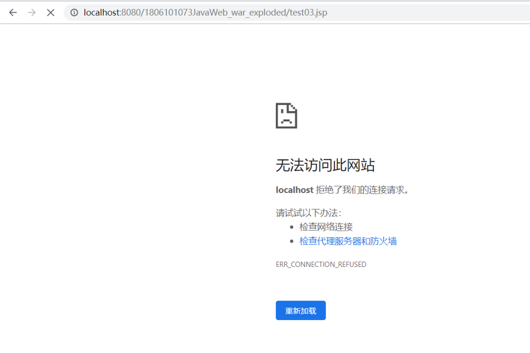
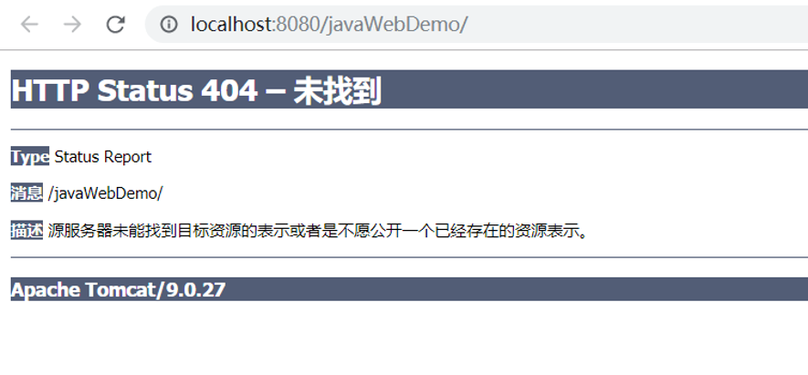
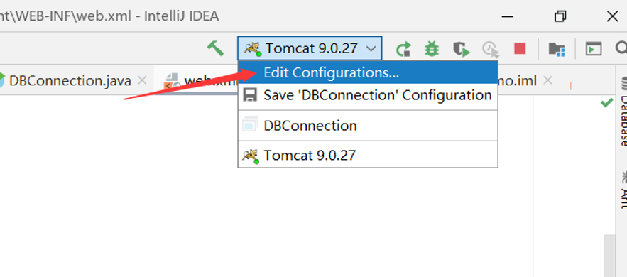
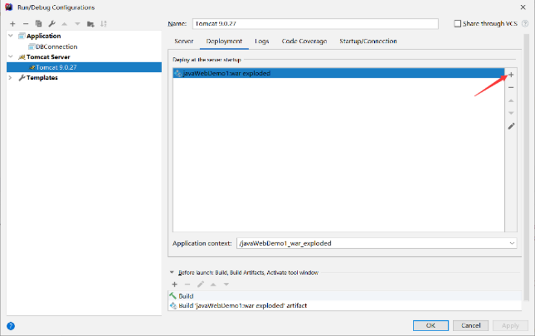
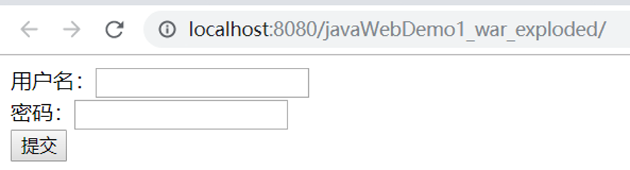

# 在开发web程序时常遇到的错误

## 前言

在开发Web程序时会不可避免地犯下一些错误，下面将通过观察这些错误出现的现象来学习排除错误的方法，进而排除这些错误。

## 未启动Tomcat

如果未启动Tomcat就打开浏览器输入地址的话，谷歌浏览器就会提示“无法访问此网站”，如图所示



处理办法：启动Tomcat或者检查Tomcat服务能否正确运行。输入地址：```http://lacalhost:8080```，如果正确启动了，将显示Tomcat服务的首页。

## 未部署Web应用就访问

如果启动了服务但是没有部署Web应用就访问页面，将在浏览器显示404错误，如图所示

 

这样的话就需要去部署一下项目：





这样再重新启动，就能访问了



## URL错误

如果已经启动了服务并且部署项目也都正确，那么在地址栏输入一个错误的地址，那么也会出现404错误页面，这时候就需要检查URL，首先查看URL的前两部分（即协议与ip地址、端口号）是否正常，然后检查文件名的大小写是否正确，URL的大小写是敏感的。

## 总结

在开发Web项目的时候，总是会遇到各种各样的问题，我们要学会如何解决问题，可以去百度搜索，问问其他人。最后，你如果解决了很多问题的话，那么你的技术就会进一步提升。
