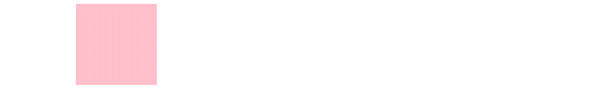
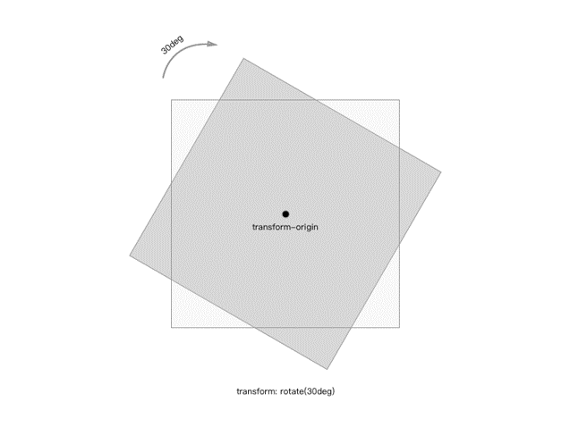
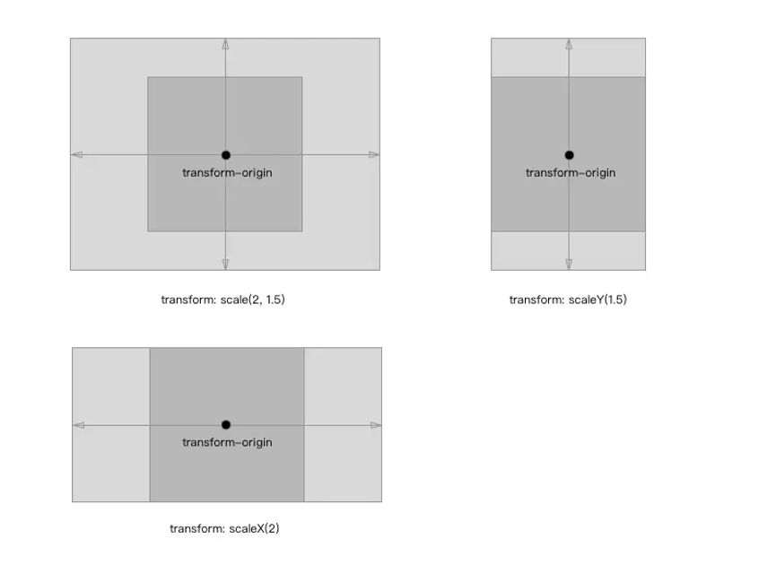
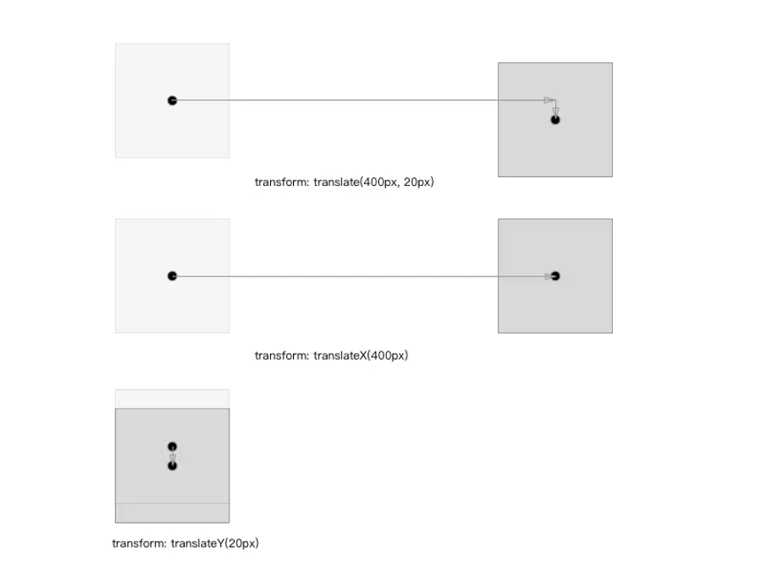
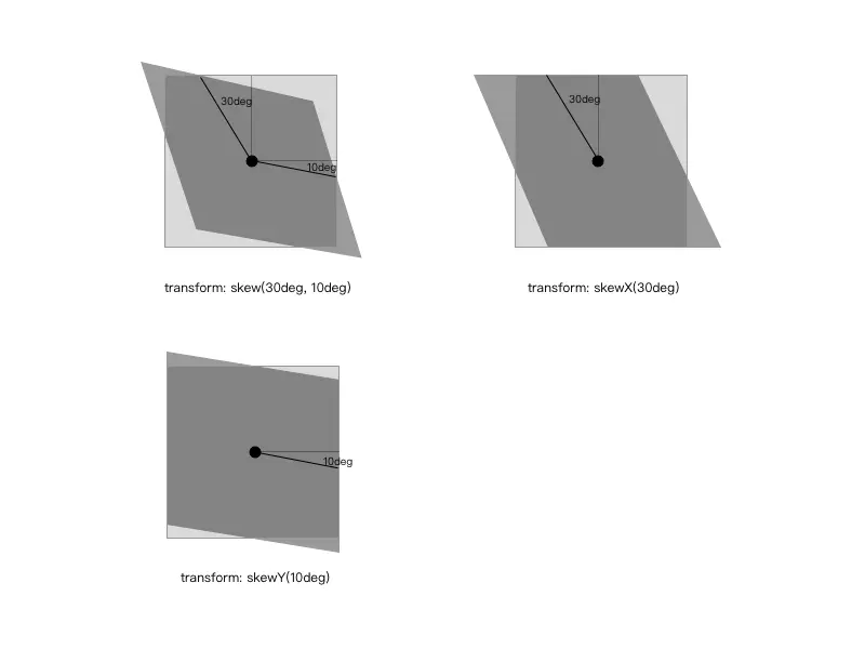
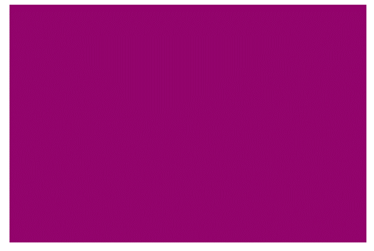
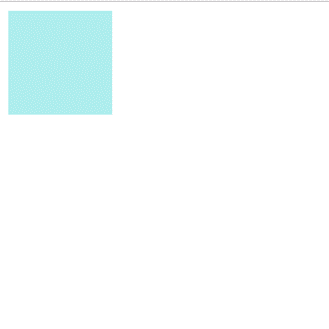
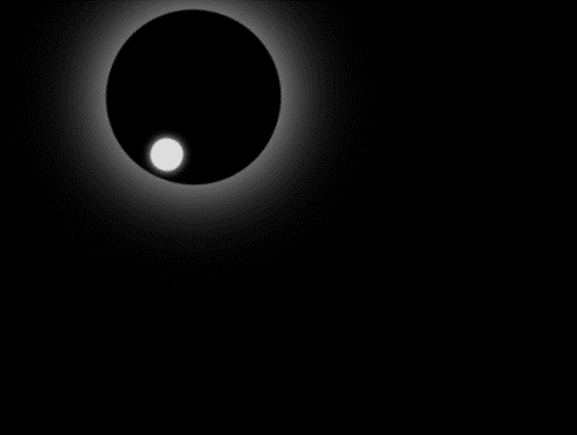

summary: demo
id: 20200212-03-杨金月
0ries: webpage
tags: 
status: Published 
authors: 杨金月
Feedback Link: http://www.sctu.edu.cn

# CSS的动画实现
一些 CSS 属性是可以实现动画效果，即我们可以用CSS实现动画和过渡。而动画属性的实现其实就是，属性逐渐地从一个值变化到另一个值，比如尺寸大小、数量、百分比和颜色，也就是通过设置多个节点来精确控制一个，或一组动画，常用来实现复杂的动画效果从而实现动画。动画是CSS最具有颠覆性的特征之一，接下来我们就来感受一下CSS的动画吧。
## 1、方法
1）定义动画：用keyfames定义动画（类似定义类选择器）。
```js
@keyframes 动画名称{
                0%{
                    width:0px;
                }
                100%{
                    width:1200px;
                }
         }
```
2）使用（调用）动画
在此处我们设计一个盒子，当我们打开网页时它可以从左边跑到右边。
```html
<!DOCTYPE html>
<html lang="en">
<head>
    <meta charset="UTF-8">
    <title></title>
    <style>
        /* 1. 定义动画 */
        @keyframes moving{
            /* 开始状态（从0px处开始滑动）*/
            0%{
                transform: translateX(0px);
            }
            /* 结束状态（滑动到1200px处结束）*/
            100%{
                transform: translateX(1200px);
            }
        }
        .i{
            width:200px;
            height: 200px;
            background-color: pink;
            /* 2.调用动画 */
            /* 动画名称（上方@keyframes 定义的动画名称）*/
            animation-name: moving;
            /* 持续时间 （动画持续6秒）*/
            animation-duration: 6s;
        }
    </style>
</head>
<body>
    /*调用div样式*/
	 <div class="i"></div>
</body>
</html>
```
实现的效果：  
  
讲解:  
0%是动画的开始，100%是动画的完成。这样的规则就是动画序列。  
在@keyframes中规定某项CSS样式，就能创建由当前改为新样式的动画效果。  
动画是使元素从一种样式逐渐变化为另一种样式的效果。您可以改变任意多的样式任意多的次数。  
我们除了用百分比来规定变化发生的时间，还可用关键词“from”和“to”，等同于0%和100%来实现。  
## 2、常见属性animation
animation比较类似于 flash 中的逐帧动画，逐帧动画就像电影的播放一样，表现非常细腻并且有非常大的灵活性。然而transition只是指定了开始和结束态，整个动画的过程也是由特定的函数控制。学习过 flash 的同学知道，这种逐帧动画是由关键帧组成，很多个关键帧连续的播放就组成了动画，在 CSS3中是由属性keyframes来完成逐帧动画的。  
@keyframes:  
```js
@keyframes animationName {
    from {
        properties: value;
    }
    percentage {
        properties: value;
    }
    to {
        properties: value;
    }
}
//or
@keyframes animationName {
    0% {
        properties: value;
    }
    percentage {
        properties: value;
    }
    100% {
        properties: value;
    }
}
```
animationName：动画名称，开发人员自己命名；  
percentage：为百分比值，可以添加多个百分比值；  
properties：样式属性名称，例如：color、left、width等等。  
animation-name：
用来设置动画的名称，可以同时赋值多个动画名称，用,隔开;  
```
animation-name: none | IDENT[,none | IDENT]*;
```
animation-duration:   
用来设置动画的持续时间，单位为s，默认值为0;
```
animation-duration: <time>[,<time>]*;
```
animation-delay:   
设置动画的开始时间，单位是s或者ms，默认值为0;  
```
animation-delay: <time>[,<time>]*;
```
animation-iteration-count:   
置动画循环的次数，默认为1,infinite为无限次数的循环;  
```animation-iteration-count:infinite | number>[,infinite | <number>]*;
```
animation-direction:   
置动画播放的方向，默认值为normal表示向前播放，alternate代表动画播放在第偶数次向前播放，第奇数次向反方向播放;  
```
animation-direction: normal | alternate [, normal | alternate]*;
``` 
animation-play-state:   
控制动画的播放状态：running代表播放，而paused代表停止播放，running为默认值：  
```
animation-play-state:running | paused[,running | paused]*;
```
animation:   
它是animation-name、animation-duration、animation-timing-function、animation-delay、animation-iteration-count、animation-direction的简写：  
```
animation:[<animation-name> || <animation-duration> || <animation-timing-function> || <animation-delay> || <animation-iteration-count> || <animation-direction>] [, [<animation-name> || <animation-duration> || <animation-timing-function> || <animation-delay> || <animation-iteration-count> || <animation-direction>] ]*;
```
## 3、常见属性transform
transform可以用来设置元素的形状改变，主要有以下几种变形：rotate（旋转）、scale（缩放）、skew（扭曲）、translate（移动）和matrix（矩阵变形）；  
```
transform ： none | <transform-function> [ <transform-function> ]*
```
none表示不做变换；<transform-function>表示一个或多个变化函数，变化函数由函数名和参数组成，参数包含在()里面，用空格分开；  
```
transform ： rotate(30deg) scale(2,3);
```
transform-origin 基点：  
所有的变形都是基于基点，基点默认为元素的中心点。用法：transform-origin: (x, y)，其中 x 和 y 的值可以是百分比、rem 或者是 px 等等，也可以用表示位置的单词来表示例如：x 可以用left、center、right；y 可以用top、center、bottom。  
```
transform-origin: (left, bottom);
```
rotate 旋转：  
用法：rotate(<angle>)；表示通过指定的角度对元素进行旋转变形，如果是正数则顺时针旋转，如果是负数则逆时针旋转；
```
.transform-rotate {
    transform: rotate(30deg);
}
```

scale 缩放:  
它有三种用法：scale(<number>[, <number>])、scaleX(<number>)和scaleY(<number>)；分别代表水平和垂直方向同时缩放、水平方向的缩放以及垂直方向的缩放，入参代表水平或者垂直方向的缩放比例。缩放比例如果大于1则放大，反之则缩小，如果等于1代表原始大小。
```js
.transform-scale {
    transform: scale(2,1.5);
}

.transform-scaleX {
    transform: scaleX(2);
}

.transform-scaleY {
    transform: scaleY(1.5);
}
```

translate 移动:  
移动也分三种情况：translate(<translation-value>[, <translation-value>])、translateX(<translation-value>)和translateY(<translation-value>)；分别代表水平和垂直的移动、水平方向的移动以及垂直方向同时移动，移动单位是 CSS 中的长度单位：px、rem等;  
```js
.transform-translate {
    transform: translate(400px, 20px);
}

.transform-translateX {
    transform: translateX(300px);
}

.transform-translateY {
    transform: translateY(20px);
}
```

skew 扭曲:  
扭曲同样也有三种情况，skew(<angle>[, <angle>])、skewX(<angle>)和skewY(<angle>)；同样也是水平和垂直方向同时扭曲、水平方向的扭曲以及垂直方向的扭曲，单位为角度。
```js
.transform-skew {
    transform: skew(30deg, 10deg);
}

.transform-skewX {
    transform: skewX(30deg);
}

.transform-skewY {
    transform: skewY(10deg);
}
```


## 4、常见属性transition
transition是用来设置样式的属性值是如何从从一种状态变平滑过渡到另外一种状态，它有四个属性：
transition-property（变换的属性，即那种形式的变换：大小、位置、扭曲等）；  
transition-duration（变换延续的时间）；  
transition-timing-function（变换的速率）;  
transition-delay（变换的延时）;  
```
transition ： [<'transition-property'> || <'transition-duration'> || <'transition-timing-function'> || <'transition-delay'> [, [<'transition-property'> || <'transition-duration'> || <'transition-timing-function'> || <'transition-delay'>]]*;
```
transition-property:  
它是用来设置哪些属性的改变会有这种平滑过渡的效果，主要有以下值:
none；all；元素属性名：color；length；visibility；  
```transition-property ： none | all | [ <IDENT> ] [ ',' <IDENT> ]*;
}
```
transition-duration:
设置转换过程的持续时间，单位是s或者ms，默认值为0；  
```
transition-duration ： <time> [, <time>]* ;
```
transition-timing-function:
它是来设置过渡效果的速率，它有6种形式的速率：  
ease：逐渐变慢（默认），等同于贝塞尔曲线(0.25, 0.1, 0.25, 1.0)；  
linear：匀速，等同于贝塞尔曲线(0.0, 0.0, 1.0, 1.0)；  
ease-in：加速，等同于贝塞尔曲线(0.42, 0, 1.0, 1.0)；  
ease-out：减速，等同于贝塞尔曲线(0, 0, 0.58, 1.0)；  
ease-in-out：先加速后减速，等同于贝塞尔曲线(0.42, 0, 0.58, 1.0)；  
cubic-bezier：自定义贝塞尔曲线。  
```
transition-timing-function ： ease | linear | ease-in | ease-out | ease-in-out | cubic-bezier(<number>, <number>, <number>, <number>) [, ease | linear | ease-in | ease-out | ease-in-out | cubic-bezier(<number>, <number>, <number>, <number>)]*;
```
贝塞尔曲线:  
transition-delay:  
设置过渡动画开始执行的时间，单位是s或者ms，默认值为0；  
```
transition-delay ： <time> [, <time>]*;
```
transition  
它是transition-property、transition-duration、transition-timing-function、transition-delay的简写：  
```
transition ：<property> <duration> <timing function> <delay>;
}
```
animation:  
animation比较类似于 flash 中的逐帧动画，逐帧动画就像电影的播放一样，表现非常细腻并且有非常大的灵活性。然而transition只是指定了开始和结束态，整个动画的过程也是由特定的函数控制。学习过 flash 的同学知道，这种逐帧动画是由关键帧组成，很多个关键帧连续的播放就组成了动画，在 CSS3 中是由属性keyframes来完成逐帧动画的;  
## 示例1：
代码：
```html
<!DOCTYPE html>
<html>
	<head>
		<meta charset="utf-8" />
		<title></title>
		<style>
			#mymoving {
				width:300px;
                height:200px;
                background:red;
                animation:mymove 20s infinite;
                /*Safari 和 Chrome:*/
                -webkit-animation:mymove 5s infinite;
			}
			@keyframes mymove{
                from {background-color:red;}
                to {background-color:blue;}
            }

            /*Safari 和 Chrome:*/
            @-webkit-keyframes mymove{
                from {background-color:red;}
                to {background-color:blue;}
            }
		</style>
	</head>
	<body>
        <div id="mymoving"></div>		
	</body>
</html>
```
效果：
 
背景颜色逐渐地从红色变化到蓝色。
## 示例2
```
<!DOCTYPE html>
<html>
<head>
    <meta charset="utf-8"> 
    <title></title> 
<style> 
    div{
	    width:100px;
	    height:100px;
	    background:paleturquoise;
	    position:relative;
	    animation:myfirst 5s;
    }

    @keyframes myfirst{
    	0%   {background:pink; left:0px; top:0px;}
    	25%  {background:lightpink; left:200px; top:0px;}
    	50%  {background:hotpink; left:200px; top:200px;}
    	75%  {background:deeppink; left:0px; top:200px;}
    	100% {background:lightcoral; left:0px; top:0px;}
    }
</style>
</head>
<body>
    <div></div>
</body>
</html>
```
效果：

## 示例3
代码：
```html
<!DOCTYPE html>
<html>
	<head>
		<meta charset="UTF-8">
		<title></title>
		<style type="text/css">
			body {
	            background-color:black;
            }
            .circle1 {
	            width:100px;
	            height:100px;
	            border-radius:100px;
	            position:absolute;
	            z-index:2;
	            left:140px;
	            -webkit-animation:myfirst1 5s linear infinite;
            }
            @-webkit-keyframes myfirst1 {
	            0% {
	            	transform:rotate(0deg);
	            	box-shadow:0px 0px 10px #fff;
	            }
                50% {
                	transform:rotate(180deg);
                	box-shadow:0px 0px 45px #fff;
                }
                100% {
                	transform:rotate(360deg);
                	box-shadow:0px 0px 10px #fff;
                }
            }
            .circle2 {
	            width:10px;
	            height:10px;
	            border:4px solid #ddd;
	            border-radius:20px; 
	            left:45px;
	            top:5px;
	            position:absolute;
	            z-index:2;
	            overflow:hidden;
	            background-color:#ddd;
	            box-shadow:0px 0px 5px #fff;
            }
		</style>
	</head>
	<body>
		<div class="circle1">
            <div class="circle2"></div>
        </div>
        <script></script>
	</body>
</html>
```
效果：


参考：
[1]《CSS3 动画》一修
https://www.jianshu.com/p/15f2adfbdad0
[2]《CSS3 动画》菜鸟教程
https://www.runoob.com/css3/css3-animations.html
[3]《CSS3 动画》w3cschool
https://www.w3cschool.cn/cssref/css-animatable.html
