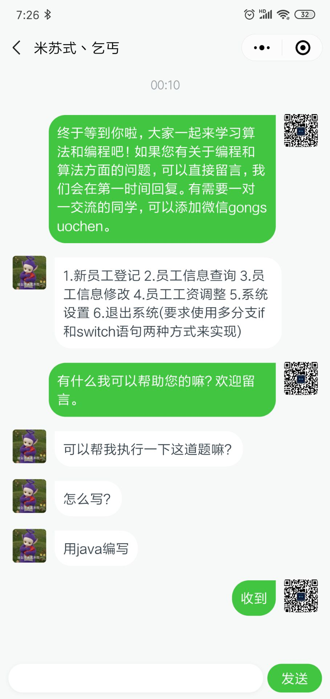

# 粉丝答疑之Java
## 问题

最近我们公众号有个粉丝向我们提出了一个关于Java的问题，如下：



## 分析

我们先来看看这个题，可以先写三个类，第一个类用来设置和获取员工的信息，第二个类写方法，包括查询，增加，删除等，第三个是测试。
## 代码
- Employee类：
```java
public class Employee {
    public static Employee[] employees = new Employee[10000];
    protected Integer id;
    private String name;
    private String address;
    private String sex;

    public Employee(){

    }


    public Integer getId() {
        return id;
    }//获取id值


    public void setId(Integer id) {
        this.id = id;
    }


    public String getName() {
        return name;
    }


    public void setName(String name) {
        this.name = name;
    }


    public String getAddress() {
        return address;
    }


    public void setAddress(String address) {
        this.address = address;
    }


    public String getSex() {
        return sex;
    }


    public void setSex(String sex) {
        this.sex = sex;
    }

    public void show() {
        System.out.println(id+"\t"+name+"\t"+sex+"\t"+address);
    }

}
```
- Method类：
```java
package src.boke1;

import java.util.Scanner;

public class Method {
    Scanner input = new Scanner(System.in);
    public void main(){
        System.out.println("请输入     1增加员工     2删除员工     3修改员工     4查询员工     5显示全部员工     6退出程序");
        System.out.println("请选择：");
        choice();
    }
    //增加员工
    public void addEmployee(){

        Employee e = new Employee();
        System.out.println("添加员工：");
        System.out.println("输入id,该Id值应为0~9999之间:");
        int idnumber = input.nextInt();
        e.setId(idnumber);
        if(0<idnumber&&idnumber>9999){
            System.out.println("请输入0~9999之间的数，请重新输入");
        }else{

//判断输入的id是否已经存在
            if(Employee.employees[e.getId()]!=null){
                System.out.println("已有id,请重新输入!若要修改该id的员工信息，请输入3进入修改。");
            }else{
                System.out.println("输入姓名:");
                e.setName(input.next());
                System.out.println("输入性别:");
                e.setSex(input.next());
                System.out.println("输入工资:");
                e.getSalary(input.next());
                Employee.employees[e.getId()] = e;
                System.out.println("添加成功");

            }
        }


    }
    //删除员工的方法
    public void deleteEmployee(){
        System.out.println("请输入要删除员工的id：");
        int id = input.nextInt();
//判断输入id是否存在
        seachID(id);
        if(Employee.employees[id]!=null){
            Employee.employees[id]=null;
            System.out.println("删除成功！");
        }
    }
    //修改
    public void changeEmployee(){
//显示全部
// showEmployee();
        System.out.println("输入需要修改的员工的id：");
        int id = input.nextInt();
//判断输入id是否存在
        seachID(id);
//如果存在就继续
        if(Employee.employees[id]!=null){
            System.out.println("请输入你要修改的选项1)id 2)姓名 3)性别 4)工资");
            int change = input.nextInt();

            switch(change){
                case 1:
                    System.out.println("修改为id：");
                    int in = input.nextInt();
                    for(int i=0;i < Employee.employees.length; i++){
                        if(Employee.employees[in]!=null){
                            System.out.println("该id已存在，请重新赋值！");
                            System.out.println("修改失败！");
                            break;
                        }else{
                            Employee.employees[id].setId(in);
                            System.out.println("修改成功");
                            break;
                        }
                    }


                    break;
                case 2:
                    System.out.println("修改为姓名：");
                    String j = input.next();
                    Employee.employees[id].setName(j);
                    System.out.println("修改成功");

                    break;
                case 3:
                    System.out.println("修改为性别：");
                    String k = input.next();
                    Employee.employees[id].setSex(k);
                    System.out.println("修改成功");

                    break;
                case 4:
                    System.out.println("修改为工资：");
                    String l = input.next();
                    Employee.employees[id].setSalary(l);
                    System.out.println("修改成功");

                    break;
                default:
                    System.out.println("请输入1-4的数！！！");
            }


        }

    }
    //查询
    public void seachEmployee(){
        System.out.println("输入需要查询的员工的id：");
        int id = input.nextInt();
        seachID(id);

    }

    //显示全部
    public void showEmployee(){
        System.out.println("id\t姓名\t性别\t工资");
        for(int i=0;i < Employee.employees.length; i++){
            if(Employee.employees[i]!=null){
                Employee.employees[i].show();
            }
        }
    }

    //判断id是否存在的方法
    public void seachID(int b){
        for(int i=0;i < Employee.employees.length; i++){
            if(Employee.employees[b]!=null){
                System.out.println("id\t姓名\t性别\t工资");
                Employee.employees[b].show();
                break;
            }else{
                System.out.println("未找到id为"+b+"的员工信息！");
                System.out.println("操作失败！");
                break;
            }
        }
    }

    public void choice(){
        int i = input.nextInt();
        switch(i){
            case 1:
//增加员工
                addEmployee();
                main();
                break;
            case 2:
//删除员工
                deleteEmployee();
                main();
                break;
            case 3:
//修改员工
                changeEmployee();
                main();
                break;

            case 4:
//查询员工
                seachEmployee();
                main();
                break;

            case 5:
//显示全部
                showEmployee();
                main();
                break;
            case 6:
//退出程序
                System.out.println("************************退出成功************************");
                break;
            default:
                System.out.println("输入有误，请重新输入！");
                main();

        }
    }

}
```
- Test方法：
```java
public class Test {
    public static void main(String[] args) {

        System.out.println("***********************************欢迎使用员工管理系统***********************************");
        Method method = new Method();
        method.main();


    }

}
```
## 总结
在学Java的时，看到题目，首先要先思考，先写一个大概框架，然后再去具体完善。在刚开始的时候我们学习Java基础，掌握了基础，其次就需要学习编程思想，学习编程的思想就是为了能够有效的能够使用编程语言的特性去实现目的，每个人的思想不一样，我们都要找到自己的编程思想，这样才能够将所学的知识融会贯通，能够写出更好的程序。
