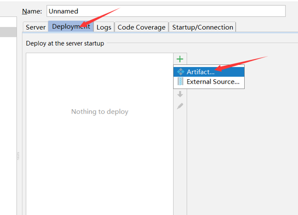

# 在IDEA中快速搭建Spring MVC项目

##  新建 ```project```
选择spring，然后next，接着自行命名，最后finish即可。


IDEA会自动的帮我们下载需要的包。最后完成创建后项目结构如下


## 修改 ```web.xml```
如下，就修改了```<url-pattern>```的值为/，目的是拦截所有的请求，并交由```spring mvc```的后台控制器来处理。


## 编辑 ```dispatcher-servlet.xml```
```java
<?xml version="1.0" encoding="UTF-8"?>
<beans xmlns="http://www.springframework.org/schema/beans"
       xmlns:xsi="http://www.w3.org/2001/XMLSchema-instance"
       xsi:schemaLocation="http://www.springframework.org/schema/beans http://www.springframework.org/schema/beans/spring-beans.xsd">
    <bean id="simpleUrlHandlerMapping"
          class="org.springframework.web.servlet.handler.SimpleUrlHandlerMapping">
        <property name="mappings">
            <props>
                <!-- /hello 路径的请求交给 id 为 helloController 的控制器处理-->
                <prop key="/hello">helloController</prop>
            </props>
        </property>
    </bean>
    <bean id="helloController" class="controller.HelloController"></bean>
</beans>
```
## 编写 ```HelloController```

```java
package controller;
import org.springframework.web.servlet.ModelAndView;
import org.springframework.web.servlet.mvc.Controller;
public class helloController implements helloController1 {
    @Override
    public ModelAndView handleRequest(javax.servlet.http.HttpServletRequest httpServletRequest, javax.servlet.http.HttpServletResponse httpServletResponse) throws Exception {
        ModelAndView mav = new ModelAndView("index.jsp");
        mav.addObject("message", "Hello Spring MVC");
        return mav;
    }
}
```
```Spring mvc```通过```ModelAndView```对象把模型和视图结合在一起，这里视图是```index.jsp```数据模型为```message```，内容是```hello spring mvc```
## ```index.jsp```
```
<%@ page contentType="text/html;charset=UTF-8" language="java" %>
<html>
  <head>
    <title>$Title$</title>
  </head>
  <body>
  <h1>${message}</h1>
  </body>
</html>
```
## 部署 tomcat
- run-edit configurations…



 
最后点击ok然后运行就好了
## 运行
重启服务器，然后输入地址：```localhost/hello```
