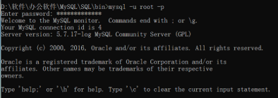
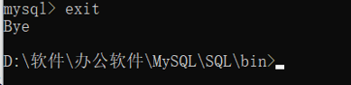
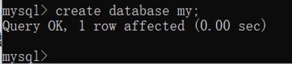

# MySQL数据库连接与创建

## 连接

在安装好MySQL后，环境也搭建好了，接下来就是连接到数据库了。我们可以使用MySQL二进制方式连接。

- 先进入MySQL：输入```mysql  -u root  -p```，然后输入密码就行了, 如图所示

  

- 登录成功后会出现 ```mysql>``` 命令提示窗口，你可以在上面执行任何 SQL 语句。在这里我们使用了```root```用户登录到```mysql```服务器，我们也可以使用其他```mysql```用户登录。如果用户权限足够，任何用户都可以在```mysql```的命令提示窗口中进行```SQL```操作。退出 ```mysql>``` 命令提示窗口可以使用 ```exit``` 命令，如下所示：
  
  
## 创建

在登录后，我们就可以创建我们的第一个数据库了。具体是使用```create```命令创建数据库，具体语法是：



对于普通用户你可能需要特定的权限来创建或者删除 MySQL 数据库。所以我们这边使用root用户登录，root用户拥有最高权限，可以使用 ```mysql mysqladmin``` 命令来创建数据库。以下命令简单的演示了创建数据库的过程，数据名为 my: 

  

这就是最基本的登录与创建一个数据库了，再创建完数据库后，还有很多操作，需要继续学习MySQL的命令。
