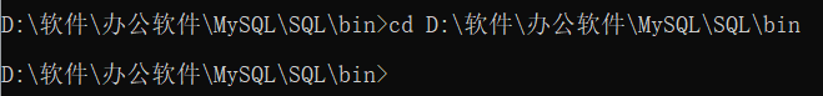
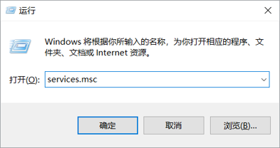
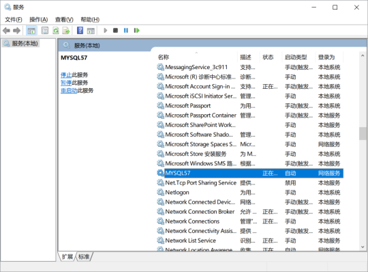
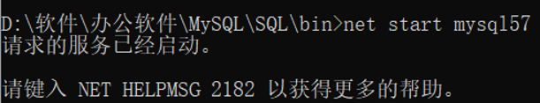
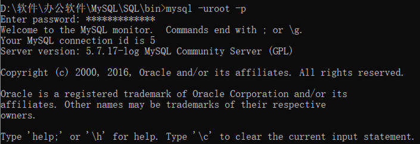

# 在CMD中运行mysql出现的一些问题
## 问题描述

在学习数据库之前，安装了mysql，但是在用CMD运行mysql的时候老是出一些问题，在这里做一些整理。

首先是在CMD中输入```net start mysql```后，出现```服务器无效，请键入NET HELPMSG 2185以获得更多帮助```
原因是因为```net start +服务名```，启动的是win下注册的服务。此时，系统中并没有注册mysql到服务中。即当前路径下没有mysql服务。所以我们现在要做的是将mysql注册到win服务当中。
## 解决方案
- 来到mysql的安装路径下bin的路径
  

- 输入```mysqld—install```,如果出现```Service successfully install```就代表安装成功。
这时候如果安装不成功或者我们在输入```net start mysql```，但是发现还是没法运行。这可能出现了另外的问题。

- 打开服务窗口
  
  
- 找到```MYSQL```服务，这里名称是```MYSQL57```
  
  
- 所以我们在用```cmd```输入命令的时候要将```mysql```改为```mysql57```
- 使用管理员的身份打开CMD
我们现在来看看运行的结果

  

- 重复第一步在mysql安装目录的bin文件下，打开一个新的命令行， 输入“mysql -uroot -p”，之后输入数据库密码就可以登录数据库了。
 
  
## 总结

在实际学习当中可能会遇到各种各样的问题，有些虽然都是一些小问题，但是我们要细心去发现哪里出现了问题并且解决它，只有解决了一个又一个小问题过后，才能更一步提高自己。
