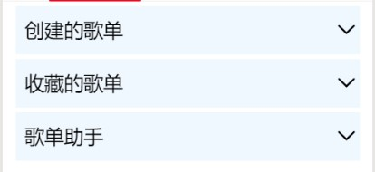
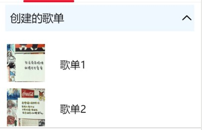

summary: demo
id: 20200215-01-吴怡辰
categories: wechat
tags: 
status: Published 
authors: 吴怡辰
Feedback Link: http://www.sctu.edu.cn
# 自定义折叠面板
## 问题描述
在小程序页面中，一个可点开、关闭的折叠面板，并且能在点开面板中任意添加不同的内容，我们能够如何实现呢？
## 效果图


## 解决步骤
### wxml事件绑定
首先需要在view中加入data-index在事件中获取这些自定义的节点数据，用于事件的逻辑处理；然后需要添加catchtap事件绑定。
注意：关闭时是向下箭头，点击后是向上箭头。这个过程需要对图片进行条件渲染，添加一个shouIndex。
wxml代码如下：
```
<view class='help_item'>
    <view class='title' data-index='1' catchtap='panel'>
      <view class='title_1'>创建的歌单</view>
      <view class='title_2'><image src="/images/{{showIndex == 1 ? 'up':'down'}}.png"></image></view>
    </view>
    <view class='detail' wx:if="{{showIndex == 1}}">
    <view class="v2">
      <view>
      <image class="img" src="/images/img4.jpg"></image>
      <text class="t1">歌单1</text>
      </view>
      <view>
      <image class="img" src="/images/img5.jpg"></image>
      <text class="t1">歌单2</text>
      </view>
      <view>
      <image class="img" src="/images/img6.jpg"></image>
      <text class="t1">歌单3</text>
      </view>
    </view>
    </view>
  </view>
```
### wxss配置
在wxss中需要配置将文字和箭头图片放在一行的左右两端。代码如下：
```
.help_item {
  margin: 10rpx auto;
}
.title {
  font-size: 40rpx;
  height: 100rpx;
  line-height: 100rpx;
  background: aliceblue;
  display: flex;
}
.title_1 {
  width: 630rpx;
  height: 100rpx;
  padding-left: 20rpx;
}
.title_2 {
  width: 50rpx;
  height: 100rpx;
  text-align: center;
}
.title_2 image {
  width: 40rpx;
  height: 40rpx;
  margin: 30rpx auto;
}
```
### js配置
在wxml中已经准备好的事件catchtap='panel'进行数据的绑定。代码如下：
```
  panel: function (e) {
    if (e.currentTarget.dataset.index != this.data.showIndex) {
      this.setData({
        showIndex: e.currentTarget.dataset.index
      })
    } else {
      this.setData({
        showIndex: 0
      })
    }
  },
```
## 总结
折叠面板的实现主要放在事件绑定上，注意用到的是catch事件绑定，因为它可以阻止冒泡事件向上冒泡。折叠面板也可以根据需要在展开的面板中进行自定义的配置。