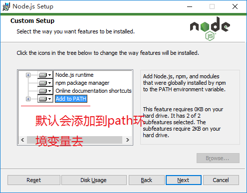

# 前端自动化构建工具Gulp.js
## 简介
gulp是一个自动化构建工具，主要用来设定程序自动处理静态资源的工作。简单的说，gulp就是用来打包项目的。
## 安装
#### 安装Nodejs
进入 http://nodejs.org/en 下载 12.15.0LTS
完成后双击安装



打开CMD检查是否正常
#### 安装npm

输入命令npm config set registry=http://registry.npm.taobao.org 配置镜像站
#### 安装gulp
全局安装```Gulp cnpm install gulp -g```

检查版本 ```gulp -v```

本地安装gulp，作为开发依赖 ```cnpm install gulp -D```

安装 gulp 命令行工具```npm install --global gulp-cli```

## 使用
创建根目录 ```my_project``` 并进入
```
npx mkdirp my-project
cd my-project
```
在项目目录下创建 package.json 文件
``` 
npm init
```
安装 gulp，作为开发时依赖项
```
npm install --save-dev gulp
```
在项目的根目录下创建 ```gulpfile.js``` ，名字一定不能写错。并在文件里写入以下内容：
```js
const gulp = require("gulp");
//定义任务
gulp.task("message",function (done) {
    console.log("gulp is running!!");
    done()
});
js
//定义默认任务 
gulp.task("default",gulp.series(['message','copyHtml','scripts','sass','imageMin']));


```
在项目根目录下执行命令
 ```
 gulp message
 ```
执行默认任务命令
```
gulp
```

出现以下内容就运行成功了
```
C:\Users\19145\my-project>gulp message
[14:34:39] Using gulpfile ~\my-project\gulpfile.js
[14:34:39] Starting 'message'...
gulp is running!!
[14:34:39] Finished 'message' after 1.85 ms


```
接下来介绍几个常用的插件

文件目录：

├── dist      //处理后的文件存放位置     
├── node_modules    
├── src      //项目静态文件存放位置    
├── gulpfile.js    
└── package.json

### 1 拷贝文件 

```js
//拷贝文件
gulp.task("copyHtml" ,function(done){
    gulp.src("src/*.html").pipe(gulp.dest("dist"));
    done();
});

```
### 2 图片压缩

```js

var imagemin = require("gulp-imagemin");

//图片压缩
gulp.task("imageMin",function (done) {
    gulp.src("src/image/*").pipe(imagemin()).pipe(gulp.dest("dist/images"));
    done();
});

```
### 3 压缩JS

```js

var uglify = require("gulp-uglify");
//压缩js
gulp.task("minify",function (done) {
    gulp.src("src/js/*.js").pipe(uglify()).pipe(gulp.dest("dist/js"));
    done()
 });

```
### 4 sass 转换 css
```js
var sass = require("gulp-sass");

//
gulp.task("sass",function (done) {
    gulp.src("src/sass/*.scss").pipe(sass()).pipe(gulp.dest("dist/css"));
    done()
});
```

### 5 代码合并
```js
var concat = require("gulp-concat");

//代码合并
gulp.task("scripts",function (done) {
    gulp.src("src/js/*.js").pipe(concat("min.js")).pipe(uglify()).pipe(gulp.dest("dist/js"));
    done()
});

```
### 6 监听文件

```js
const gulp = require("gulp");
var imagemin = require("gulp-imagemin");
var uglify = require("gulp-uglify");
var sass = require("gulp-sass");
var concat = require("gulp-concat");

//监听文件
gulp.task('watch',async()=> {
    gulp.watch("src/js/*.js",async()=>{
        gulp.src("src/js/*.js")
        .pipe(concat("min.js"))
        .pipe(uglify())
        .pipe(gulp.dest("dist/js"));
        });
    gulp.watch("src/image/*",async()=>{
        gulp.src("src/image/*")
        .pipe(imagemin())
        .pipe(gulp.dest("dist/images"));
        });
    gulp.watch("src/sass/*.sass",async()=>{
        gulp.src("src/sass/*.scss")
        .pipe(sass())
        .pipe(gulp.dest("dist/css"));
        });
    gulp.watch("src/*.html",async()=>{
        gulp.src("src/*.html")
        .pipe(gulp.dest("dist"));
        });

});

```


