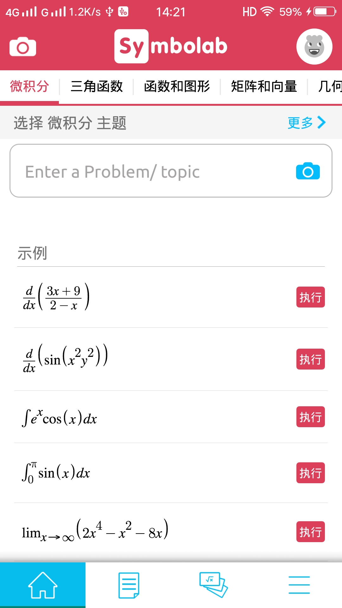
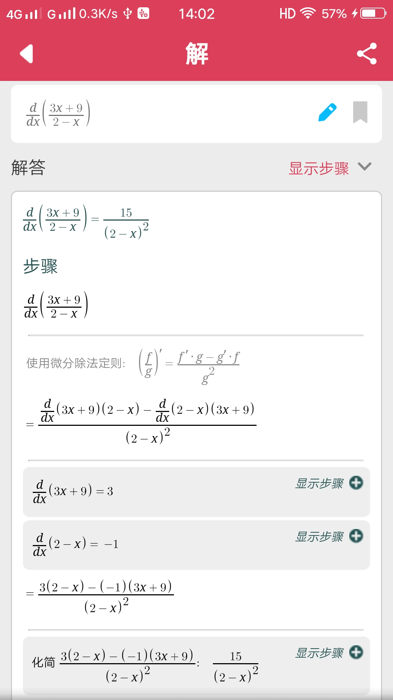
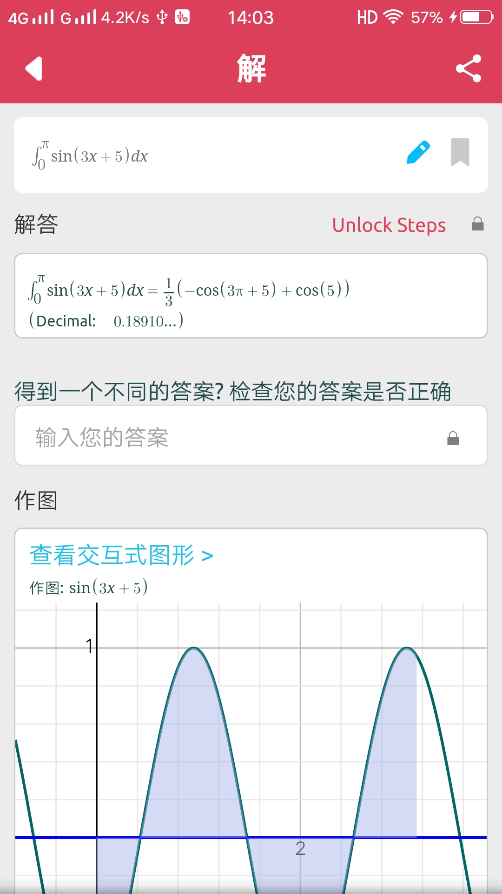
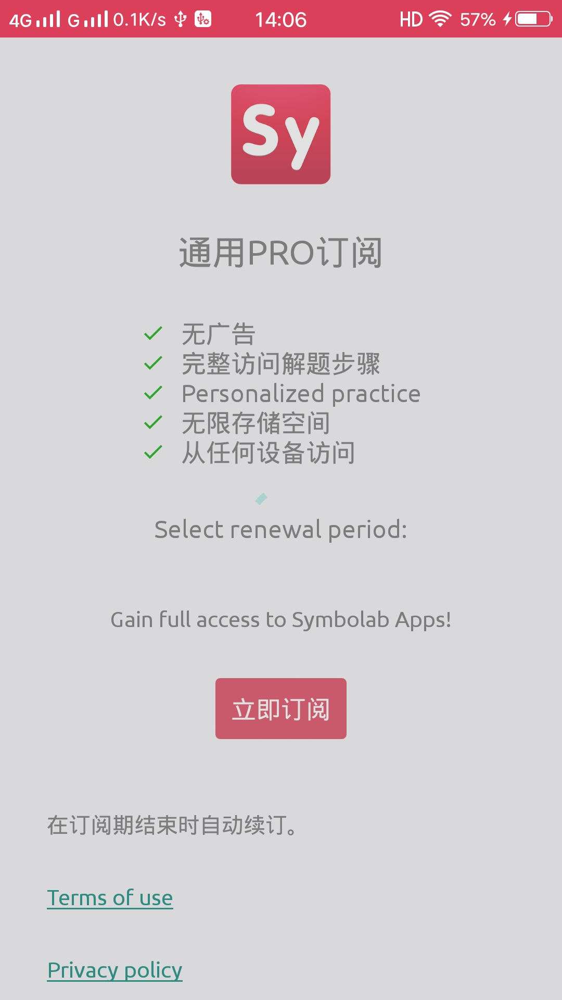
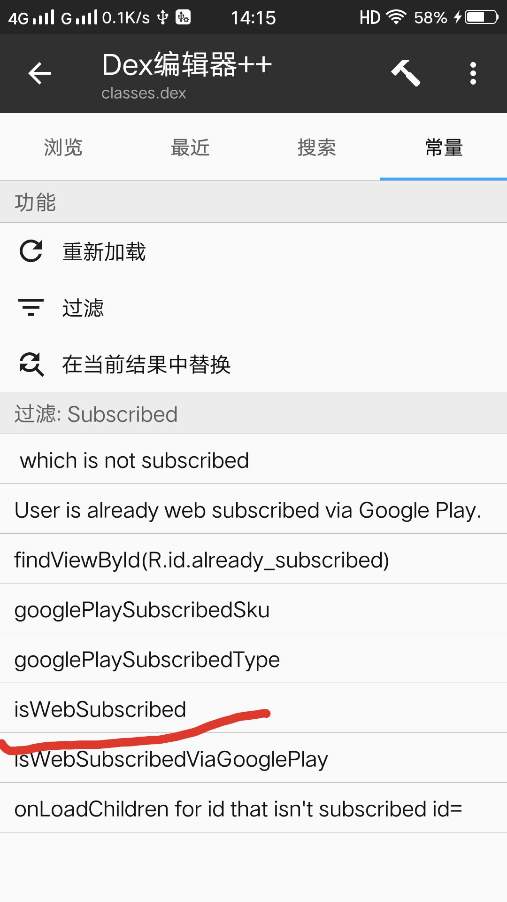
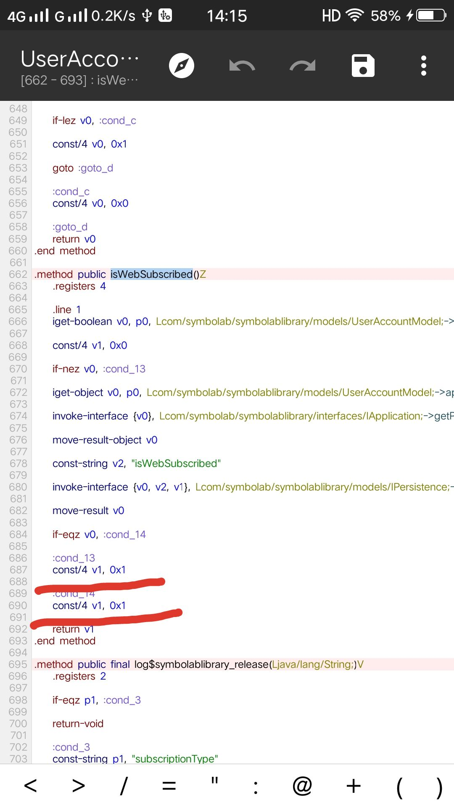
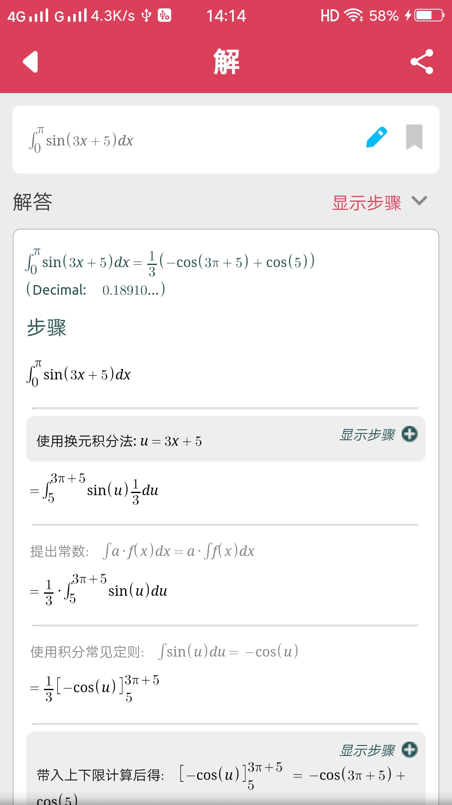

summary: demo
id: 20200210-01-官学琦
categories: security
tags: sctu-android
status: Published 
authors: 官学琦
Feedback Link: http://www.sctu.edu.cn

#app收费服务破解—高数学习神奇Symbolab Practice

##案例介绍
Symbolab是一款由国外程序员开发的包含大学高数所有知识的学习神器，它能帮助你解析代数、微积分、三角函数及矩阵等运算的详细步骤，还能帮助你复习所学的高数公式。

##破解必备

###使用工具：

Android手机一部、mt管理器

###必备知识

Smali语言基础、掌握apk文件的基本构成及各文件的作用

##破解步骤
###第一步
打开软件观察收费系统，我们通过测试得出两个结果：

1、使用已有的案例可以看到运算步骤

2、自己输入的公式不能看到详细的运算步骤（收费）

###第二步
查找收费关键词，我们通过点击“unlock steps”解锁步骤会弹出一个订阅（Subscribe）界面

###第三步
查找关键词破解收费，我们打开逆向工具找到并打开symbolab安装包，通过搜索字符串“subscribe”得到最终的关键词“iswebsubscribe”

###第四步
修改代码破解软件，通过查找关键词我们找到了“isWebSubscribe”方法，该方法返回值为布尔类型，我们只需把返回值改为真即可

###成果展示

##免责声明
以上内容仅供学习交流，不得传播以及各种商业行为，请支持正版软件。本人不会发布与之相关的任何文件，如有侵权请及时联系官方删除。

