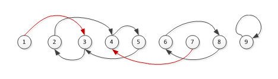
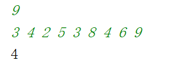
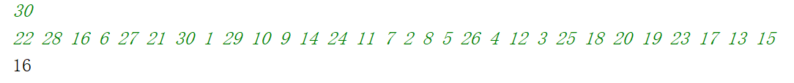

summary: demo
id: 20200210-01-饶龙江
categories: python
tags: sctu-lanqiao
status: Published 
authors: 饶龙江
Feedback Link: http://www.sctu.edu.cn

# 蓝桥杯—小朋友崇拜圈
## 问题描述
Duration: 5:00
班里N个小朋友，每个人都有自己最崇拜的一个小朋友（也可以是自己）。在一个游戏中，需要小朋友坐一个圈，每个小朋友都有自己最崇拜的小朋友在他的右手边。求满足条件的圈最大多少人？

小朋友编号为1,2,3,…N，输入第一行，一个整数N（3<N<100000），接下来一行N个整数，由空格分开。要求输出一个整数，表示满足条件的最大圈的人数。

示例1输入：
9

3 4 2 5 3 8 4 6 9

则程序应该输出：4

解释：如下图所示，崇拜关系用箭头表示，红色表示不在圈中。显然，最大圈是[2 4 5 3] 构成的圈
 


图1.1 小朋友崇拜圈示意图

示例2输入：
30

22 28 16 6 27 21 30 1 29 10 9 14 24 11 7 2 8 5 26 4 12 3 25 18 20 19 23 17 13 15

程序应该输出：16
## 问题分析
Duration: 5:00
本题最大的难点在于理解题目，按照题目描述，我们很容易理解成x崇拜的人位于x的右边，也就是这组整数相邻的人构成崇拜关系，然而结合图形和输入的N个整数，发现如果将这些整数看成是一个数组nums，那么构成崇拜关系的规律应该是x崇拜nums[x-1]。 
## Python代码
Duration: 5:00
```python
N=int(input())
nums=list(map(int,input().split(' ')))#将输入的整数存入列表中
max=0#定义最大人数
for i in range(len(nums)):
    lis = []#用列表模仿崇拜圈
    con=0#定义计数器
    x=nums[i]
    while x not in lis :#判断小朋友是否在圈中，若没在则将他加入圈中并进入循环
        lis.append(x)
        x=nums[x-1]#寻找崇拜者
        con+=1#计数器加一
        if con>max:#比较计数器和最大人数，找到最大的圈
            max=con
print(max)
```

## 案列验证
 

图4.1 示例1测试结果
 
图4.2 示例2测试结果

经过测试，发现结果和题目给定结果相同，说明解题正确。

## 我有问题
Duration: 1:00
[我有问题](https://github.com/gschen/sctu-issue/issues/new)

打开上述链接，对问题进行详细的描述，我们在收到问题后，第一时间予以解答。
