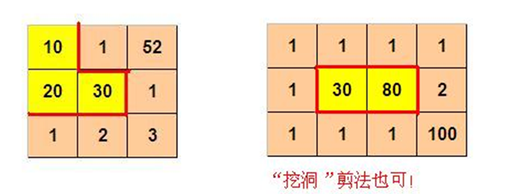

summary: demo
id: 20200216-01-马原涛
categories: python
tags: sctu-lanqiao
status: Published 
authors: 马原涛
Feedback Link: http://www.sctu.edu.cn

# DFS在矩阵中的应用-蓝桥杯：剪格子
## 前言
DFS算法常被用于寻找路径和全排列，基于不同的数据储存方式，如列表、字典、矩阵等，代码实现难度也会在差异。今天向大家分享DFS在矩阵中的代码实现，文字较多但是会涉及很有用的基础算法知识。如果对DFS还不熟悉，可以上B站看看‘正月点灯笼’的视频，讲的很不错。
## 案例
1.剪格子

如下所示，3 x 3 的格子中填写了一些整数。
<div align=center>

</div>
我们沿着图中的红色线剪开，得到两个部分，每个部分的数字和都是60。

本题的要求就是请你编程判定：对给定的m x n 的格子中的整数，是否可以分割为两个部分，使得这两个区域的数字和相等。

如果存在多种解答，请输出包含左上角格子的那个区域包含的格子的最小数目。   

如果无法分割，则输出 0

2.问题分析

我们需要矩阵分为2个区域，使每个区域的和等于整个矩阵和（t_sum）的一半。

基于DFS算法很容易就能得出思路：对每一个格子都用DFS算法遍历其上下左右四个方向。先尝试用文字来表述核心步骤：

    1.求出矩阵的和，如果是奇数不可拆分，输出0.如果是偶数执行步骤2
    2.遍历矩阵中的所有点，对于每个点，得出其坐标(x,y)，并代入步骤3
    3.行进到点（x,y），并记录当前的和n_sum（当n_sum==t_sum则输出），还有已经走过的路径path,之后执行步骤4。
    4.依次判断点(x,y)的上下左右四个方向是否能前进,不能则跳过，能则执行步骤3。
    
path用于避免走重复的路，以及最后判断最少格子数量的区域是否包含左上角的格子。

## 代码
```python
#(x+dx,y+dy)表示某个点的上下左右四个点
dx=[0,1,0,-1]
dy=[1,0,-1,0]

#输入
n, m = map(int, input().split(' '))
martix = []
t_sum=0  #输入数据的总和
for i in range(n):
    lis = []
    lis.extend(map(int, input().split(' ')))
    t_sum+=sum(lis)
    martix.append(lis)

aim_path=[]#用于记录满足条件的path
```
在文字描述的第4步中提到，需要判断上下左右也就是下一个点是否能前进,由于对于每一点都需要判断，可以将其封装为函数。

那哪些条件下不能前进呢？

    1.数组越界
    2.加上下一个数字的和已经大于总和t_sum的一半
    3.已经走过该点
```python
def judge(x,y,snum,path):
    #越界
    if x<0 or y<0 or x>=n or y>=m:
        return 'no'
    #该点访问过
    if [x,y] in path:
        return 'no'
    #走到该点已经超过和的一半

    if snum + martix[x][y] > t_sum/2:
        return 'no'
```
在文字描述中我们总是在反复执行第3步，使用递归函数可以大大减少代码量。

这段代码有3个大坑，需要特别注意：

    1.aim_path.append(path[:])，此处为啥要用path[:]而不是直接添加path.
        用path加入的数组是残缺的。
        如果你没有理解递归函数堆栈的知识和深浅拷贝的知识，这个坑可能会耗费你很多时间，这两个知识点比较复杂，感兴趣的可以百度。总而言之，当你在递归函数中无法正常使用append函数时，可以用深拷贝path[:]解决。
    2.为什么不直接用return返回的结果，而要用aim_path这个全局数组来存。
        如果你直接调用return的结果，你将得到一堆None，至于原因可以看看这篇文章，理解起来并不难，在使用递归函数时经常都能遇到这个问题（https://blog.csdn.net/ha_hha/article/details/79393041）。
    3.最后的path.pop()，需要一些回溯算法的知识，想快速的理解，将回溯下的代码删除，在dfs函数内print(path)，看一下结果再结合第2点中那篇文章的知识，或与你能明白个大概。
```python
def dfs(x,y,snum,path):
    if snum == t_sum/2:

        aim_path.append(path[:])
        return path
    #遍历(x,y)点的上右下左周围四个点

    for i in range(4):
        new_x = x + dx[i]
        new_y = y + dy[i]

        #不能走
        if judge(new_x,new_y,snum,path) == 'no' :

            continue
        else:
        #可以走
            path.append([new_x,new_y]) #表示该点已经走过

            dfs(new_x,new_y,snum+martix[new_x][new_y],path)
            #回溯
            if len(path)>1:
                path.pop()
```

```python
def main():
    #和是奇数一定不可以二分
    if t_sum%2 != 0 :
        return 0

    else:

        for x in range(n):
            for y in range(m):
                path=[[x,y]]
                dfs(x,y,martix[x][y],path)

        min_num = m * n  # 最小格子数

        for i in aim_path:
            if len(i)<min_num:
                #记录最小格子数和对应的路径
                min_num=len(i)
                best_path = i
        #判断左上角的格子是否在路径中
        if [0,0] in best_path:
            print(min_num)
        else:
            print(m*n-min_num)

main()
```