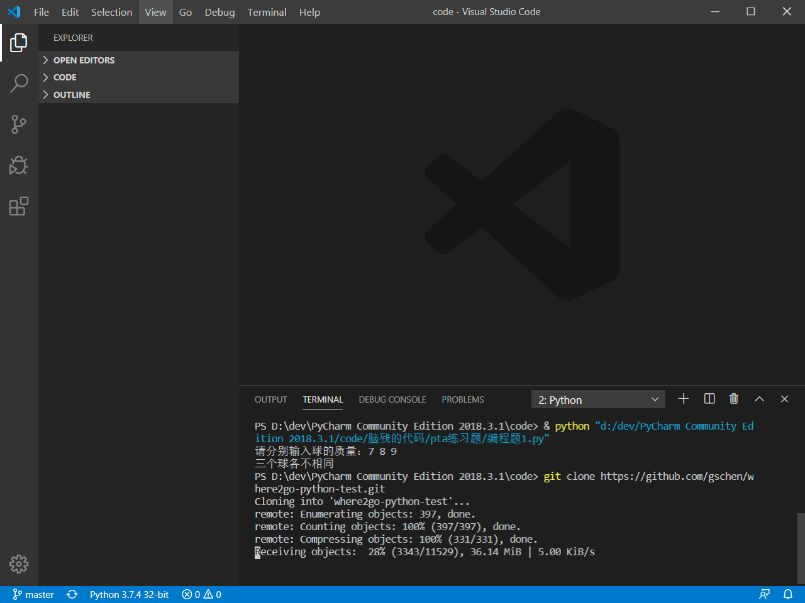
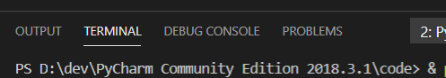

summary: demo
id: 20200218-02-江来洪
categories: 
tags: sctu-security
status: Published 
authors: 江来洪
Feedback Link: http://www.sctu.edu.cn

# 利用vscode克隆代码库
## 1 安装vscode
自行在浏览器中搜索vscode官网下载并安装好vscode
## 2 克隆代码库
在vscode中打开终端，选择view-terminal或是ctrl+`。然后在终端输入git clone url（下载地址），耐心等待下载完成即可。最后点击clone into，就会出现我们下载的目录，点击Open Folder即可，最后克隆就完成了。

## 代码提交
克隆了代码库后，点击自己写的代码文件旁的+号，然后点击push，这里就会要你输入github账号，最后等待提交成功就可以了。