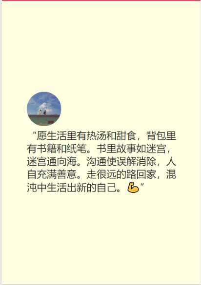

summary: demo
id: 20200223-01-吴怡辰
categories: wechat
tags: 
status: Published 
authors: 吴怡辰
Feedback Link: http://www.sctu.edu.cn
# 上下滚动页面实现
## 案例描述
小程序中，页面的呈现方式非常多样，要使页面不只是单一的一个页面，而要实现在当前页面的自由上下滚动，且上下滚动呈现出每个不同滚动页面的形式，该怎样实现呢？
## 效果图


## 实现步骤
### wxml页面实现
将每一个不同的页面进行单独且相似的wxml代码编写，每个页面放入一个整体的view中，设置bind事件绑定，scroll组件实现滚动事件。scrollTouchStart——滚动页面起始，scrollTouchEnd——滚动页面结束，scrollTouchMove——滚动的过程。代码如下：
```
<view id='hook1' class="section section01 {{scrollindex==0?'active':''}}" style='background:lightyellow' bindtouchstart="scrollTouchStart" bindtouchmove='scrollTouchMove' bindtouchend="scrollTouchEnd">
  <view class='cont'>
    <view class='cont-body'>
      <view>
      <image class="pic" src="/images/img1.jpg"></image>
      </view>
      <view>“愿生活里有热汤和甜食，背包里有书籍和纸笔。书里故事如迷宫，迷宫通向海。沟通使误解消除，人自充满善意。走很远的路回家，混沌中生活出新的自己。💪”
      </view>
    </view>
  </view>
</view>
```
### wxss配置
让每个页面呈现独立性，需要将页面设置height:100%;对每个页面设置一个position定位属性为relative，使每个页面的内容都能够在单独页面呈现。代码如下：
```
.scroll-fullpage {
  height: 100%;
}
.section {
  height: 100%;
}
.cont {
  width: 100%;
  height: 100%;
  margin: 0 auto;
  position: relative;
}
.cont-body {
  width: 75%;
  position: absolute;
  left: 50%;
  top: 50%;
  transform: translate(-50%, -50%);
}

.pic{
   height: 130rpx;
   width: 130rpx;
   border-radius: 50%
}
```
### js配置
date数据的配置和scrollTouchStart、scrollTouchMove、scrollTouchEnd三个事件函数进行配置。
代码如下：
```
  data: {
    scrollindex: 0, 
    totalnum: 4,
    starty: 0, 
    startTime: 0,
    endy: 0, 
    endTime: 0,
    critical: 80, 
    maxTimeCritical: 300, 
    minTimeCritical: 100, 
    margintop: 0,
    currentTarget: null,
  },
```
```
 scrollTouchStart: function (e) {
    let py = e.touches[0].pageY,
      stamp = e.timeStamp,
      currentTarget = e.currentTarget.id;
    console.log(py);
    this.setData({
      starty: py,
      startTime: stamp,
      currentTarget: currentTarget
    })
  },
  scrollTouchMove(e) {
    // console.log(e);
  },
  scrollTouchEnd: function (e) {
    let py = e.changedTouches[0].pageY,
      stamp = e.timeStamp,
      d = this.data,
      timeStampdiffer = stamp - d.startTime;
    this.setData({
      endy: py,
      endTime: stamp
    })
```
## 总结
在配置一个滚动页面时，注意对页面整体性和每个滚动页面独立性的实现。注意绑定事件，调用scroll组件。