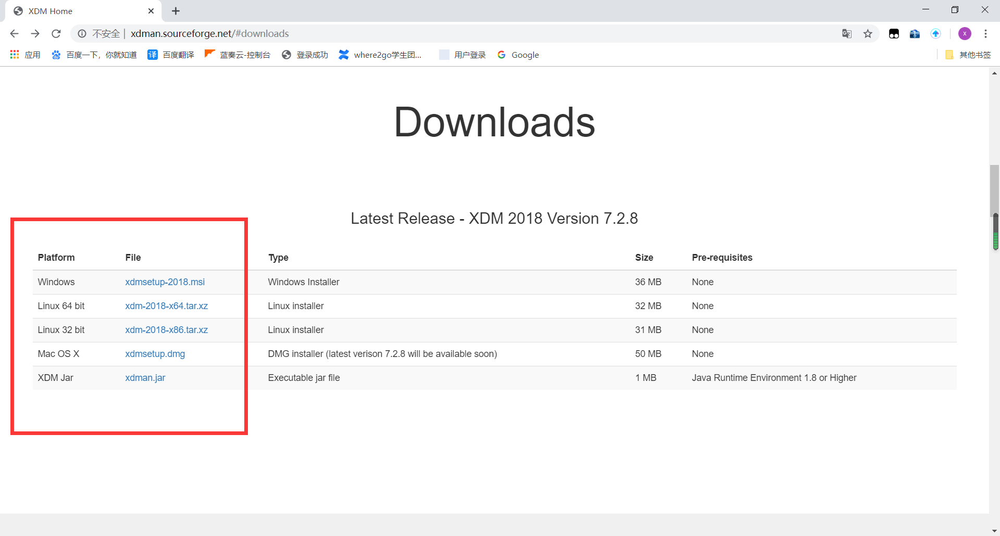
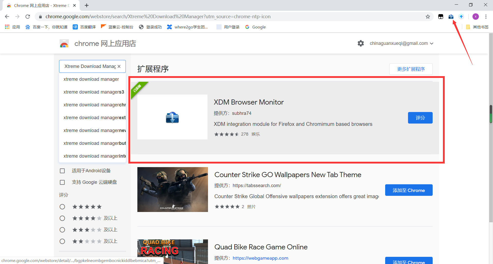
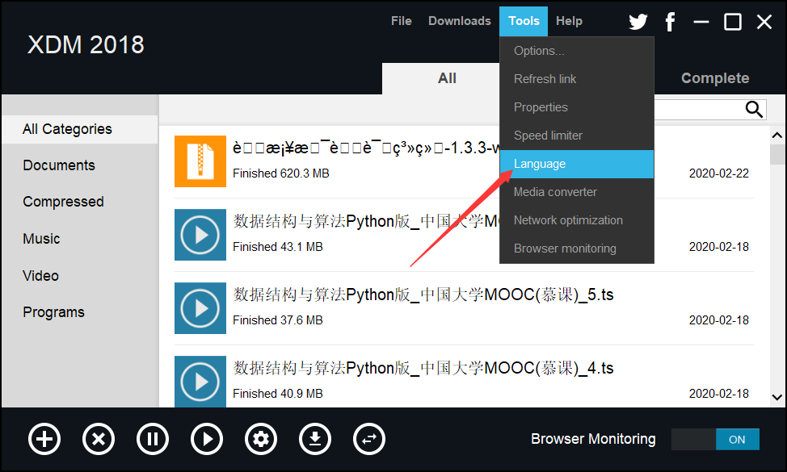
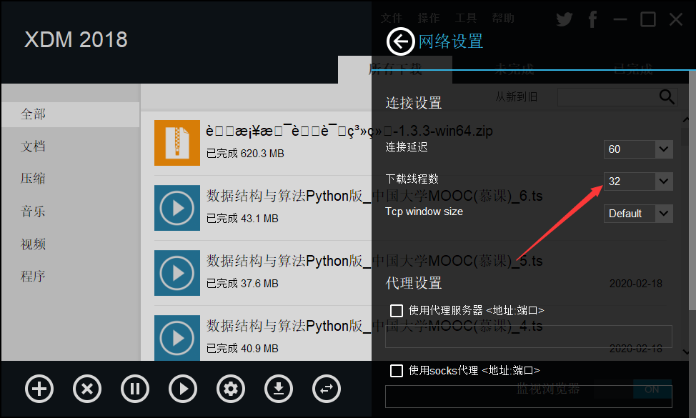
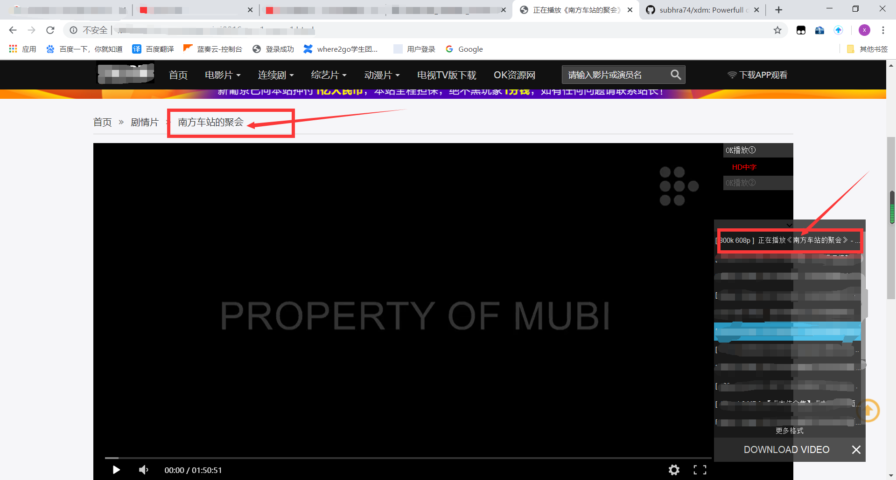
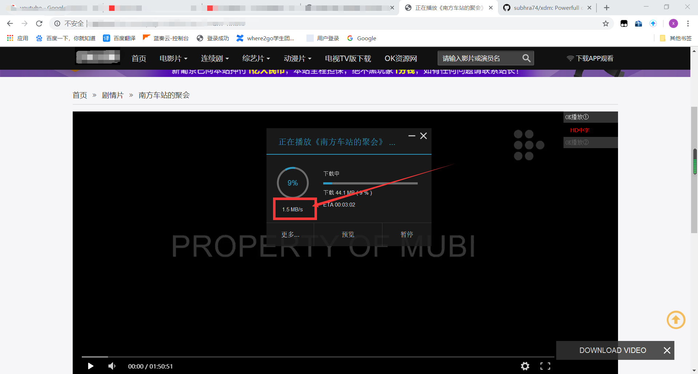

summary: demo
id: 20200210-01-官学琦
categories: 
tags: 
status: Published 
authors: 官学琦
Feedback Link: http://www.sctu.edu.cn

#免费高速的下载神器——XMD(Xtreme Download Manager)

##案例介绍

你还在等待下载的视频或软件吗？你还在为下载限速而烦恼吗？你还在用某雷开通VIP下载视频吗？你还在为没有下载源的视频而烦恼吗（比如：youtobe）？今天我就让大家告别这些烦恼，下面介绍一下今天的主角XMD下载器。

XMD下载器是一款免费的多线程下载软件（最多32线程），让你的下载速度飙升支持BT种子。同时他提供的谷歌插件可以监视浏览器视频流，能下载多格式的视频也可以可以下载无下载源的网上视频。

##软件下载及安装步骤

###第一步

首先我们打开XMD官网（http://xdman.sourceforge.net），进入官网下载适合自己电脑的XMD版本（XMD支持windows、linux、mac）

###第二步

XMD下载器必须配合谷歌浏览器上的XMD扩展插件使用，所以我们需要进入谷歌商店（需要翻墙），搜索插件全名（Xtreme Download Manager）点击添加至扩展即可

###第三步

我们配置一下XMD下载器，我们将语言调至中文，再将下载线程调至32线程

##实战测试

我们同时打开XMD下载器和插件随便打开一个视频网站并点开任意一部电影开始测试。如下图

##总结

如果大家觉得以上内容对自己有用，希望大家点赞支持小编，同时也可以将文章发给身边需要的人。关注微信公众号“算法与编程之美”，小编会继续为大家分享更多好玩实用的黑科技。

