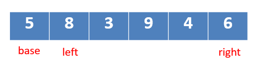

# 很简单的快速排序及python代码
## 快排原理及图解
快速排序作为排序算法中平均花费时间最少的排序算法，在各自比赛中，经常被用来处理排序问题。

今天小编来带大家理解理解快速排序的原理及python代码实现。
### 思路解析
    快排思路：
        选取一个数base(方便理解选取数组第一个数)，比这个数小的移到这个数左边，比这个数大的移到这个数右边。
    算法思路：
        1.选取一个数作为base，并选取左右指针left和right。
<div align=center>

</div>

        2.left指针每次向右移动1，找到比base大的数.right指针每次向左移动1，找到比base小的数。然后将left指针与right指针对应的数交互位置。（这样比base小的数就移到数组左边，大的就去了右边）

<div align=center>

</div>

        3.当left指针等于right指针，如果这个数小于base就与base交换，如果大于base就与left-1对应的数交换

<div align=center>

</div>

        4.将base左边的数组和右边的数组代入步骤1、2、3、4，直到数组有序。
## 快排代码解析
### 简单的伪快排代码
按照最简单的思路（选取一个数base，比这个数小的移到这个数左边，比这个数大的移到这个数右边。），我们先来实现一个简单的伪快排代码，来帮助我们更好的理解快速排序。
```python
def quick_sort(array):
    if len(array)<2:
        return array
    else:
        # 选取base
        base=0
        base_val=array[0]
        # 比base_val小的数组成一个数组
        less_base = [i for i in array[base + 1:] if i <=base_val]
        # 比base_val大的数组成一个数组
        more_base = [i for i in array[base + 1:] if i > base_val]
        # 对base_val左右两个数组执行同样操作，然后再与base+val拼接
        return quick_sort(less_base)+[base_val]+quick_sort(more_base)
```
<div align=center>
<p>测试结果</p>


</div>

很简单的代码便实现了伪快速排序，至于为什么是伪的，因为我不是对原数组进程操作，而是每次用两个额外的数组储存比base大的和小的，并且函数每运行一次边需要对传入的数组进行两次遍历。

时间和空间复杂度增加的比较多，实在对不上快速排序这个名字。但确实符合了快排的思想，接下来我们来看看完整的快排代码怎么写吧。
### 完整的快排代码
根据前文提到的算法思路，每次left和right的移动交换都要在原数组中进行。我们可以将这部分代码封装为一个函数。

因为我们需要将原数组从逻辑上划分为多个数组，所以replace_val函数需要传入这些逻辑上划分的数组的开始和结束位置，而不是base,left,right的值，这些值都可以从beg和end得到。
```python
def replace_val(array,beg,end):
    base=beg
    base_val=array[base]
    left=base+1
    right=end
    while True:
        '''
        为了防止传入的数组只有2个元素，left=base+1直接与right重合,然后就移动下标的位置，所以先判断
        '''
        # 当left和right重合
        if right <= left:
            if array[right] < base_val:
                array[base], array[right] = array[right], array[base]
            else:
                array[base], array[right + 1] = array[right + 1], array[base]
            break
        # left与right未重合
        if array[left]>array[right]:
            array[left], array[right] = array[right], array[left]
        # 当left<right并且array[left]比base_val小就继续移动
        while left<right and array[left]<=base_val:
            left+=1
        # 当right>left并且array[right]比base_val大就继续移动
        while right>=left and array[right]>base_val:
            right-=1
    
    return right
```
之后就是将执行了一次replace_val函数的数组拆成2部分再来一次。然后再拆，对每一部分，再执行replace_val函数。
```python
def quilck_sort(array,beg,end):
    #beg<end,表示beg到end最少有2个数，才需要进行排序
    if beg<end:
        ind=replace_val(array,beg,end)
        quilck_sort(array,beg,ind-1)
        quilck_sort(array,ind+1,end)

```
## 总结
    看懂了不一定会写，很多问题要在实际操作了才知道。
