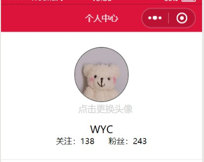

summary: demo
id: 20200301-01-吴怡辰
categories: wechat
tags: 
status: Published 
authors: 吴怡辰
Feedback Link: http://www.sctu.edu.cn
# 更换头像
## 案例描述
我们在使用小程序的时候，注册个人账号时，通常会有要更换个人头像的情况，那么这个上传图片文件更换头像的过程该如何实现呢？
## 效果图

## 实现步骤
### wxml配置
wxml中要配置一个bindtap绑定事件headimage；以及对要作为头像的图片进行head的数据绑定进行配置。代码如下：
```
<view class='v1'>   
<image class='head' bindtap="headimage" src='{{head}}'></image>  
<view class='text'  mode="aspecFill" bindtap="headimage">点击更换头像</view>
</view>
```
### wxss配置
wxss中只需要配置所需的头像边框形式（border-radius）、颜色以及图文大小、位置即可。代码如下：
```
.v1{
  display: flex;
  flex-direction: column;
  align-items: center;
}

.head {
  margin-top: 30rpx;
  width: 200rpx; 
  height: 200rpx; 
  border-radius: 50%; 
  border: 1px solid dimgrey;
}

.text { 
  line-height: 50rpx;  
  color: lightgray;  
  font-size: 35rpx;  
}
```
### js配置
js中配置绑定对数据内容或已绑定的事件处理函数。
head数据配置初始呈现头像图片，headimage作为事件处理函数中使用一个API wx.chooseImage来从本地相册选择图片或使用相机拍照。代码如下：
```
data{
  showModal: false,
  head: "/images/touxiang.jpg",
  },
  // 点击更换手机相册或者电脑本地图片    
  headimage: function () {
    var _this = this;
    wx.chooseImage({
      count: 1, // 默认9      
      sizeType: ['original', 'compressed'],
      // 指定是原图还是压缩图，默认两个都有      
      sourceType: ['album', 'camera'],
      // 指定来源是相册还是相机，默认两个都有    
      success: function (res) {    
        _this.setData({
          head: res.tempFilePaths
        })
      }
    })
  },
```
## 总结
更换头像是小程序日常使用非常普遍的操作，应用广泛值得掌握，但是本次配置存在的不足时更换头像之后无法保存的问题。请持续关注，后续会继续改进。