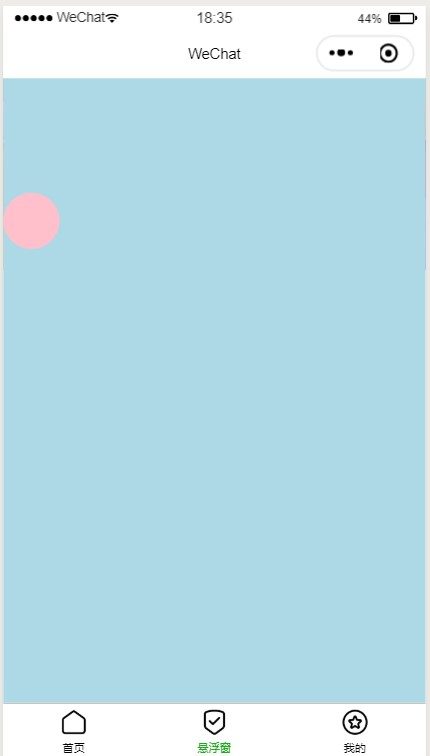

summary: demo
id: 20200308-01-吴怡辰
categories: wechat
tags: 
status: Published 
authors: 吴怡辰
Feedback Link: http://www.sctu.edu.cn
# 拖动悬浮窗
## 案例描述
不管是小程序还是软件网页等，页面上的悬浮窗总是能够引起我们的注意，而一个悬浮窗的实现，在微信小程序开发的官方文档中，可将其理解为一个可移动视图容器，那么该使用什么组件来实现这样一个功能呢？
## 效果图

## 实现步骤
一个可移动视图容器的实现只需要调用官方文档的一个movable-view组件，然后再对wxml进行简单的配置即可实现。
### 需要了解的是：
movable-view的direction属性支持以下四个值：
all - 任意方向拖动
vertical - 纵向拖动
horizontal - 横向拖动
none - 不能拖动
tips：如果direction设置为最后这个none，则只能依靠设置x,y属性值来为它进行在movable-area中的定位。
代码如下：
```
<movable-area style="pointer-events: none;height: 100%;width: 100%;position:absolute;left:0px;top:0px;background: lightblue;">
  	<movable-view direction="all" style="pointer-events: auto;height: 50px; width: 50px; background: pink;border-radius: 50%;">
		<image src='../images/icon_component_HL.png' class="imgStyle"></image>
	</movable-view>
</movable-area>
```
## 总结
我们总是在软件或者网页中，看到可自由移动的悬浮窗，而通常是一个不需要拖动的悬浮窗，甚至无法拖动的悬浮窗，后续将继续深入学习这个过程的实现。