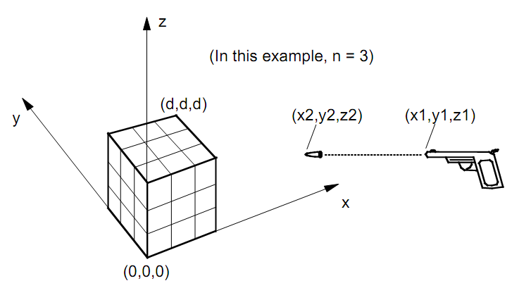

问题描述


　　一个立方体悬浮于空间中。以一个立方体底面一顶点为原点建立一个笛卡尔坐标系，如图所示。立方体棱长为d，所以它的对角线的坐标为（0，0，0）和（d，d，d，）。坐标系的z轴正方向为“向上”与重力反向。

　　立方体的内部在各个维度上有相同间隔的分割面，所以立方体被分为n^3相同尺寸的小立方体。分割面很薄且不透水，每个小立方体都充满水。小立方体内水的总量为d^3。

　　一把枪发射一发子弹可能射中立方体。这把枪枪口的位置在点（x1,y1,z1）。点(x2,y2,z2)是弹道上一点用来定义子弹的方向。子弹没有打碎立方体，但是子弹经过的地方都会留下弹孔。弹孔可以在小立方体的面，棱或顶点上。水受重力影响可能从弹孔中泄漏。所有流出的水都会被收集并测量。


输入格式

　　输入数据包含多组实验。每组实验由八个整数描述。第一个整数为n(n<=50)，如上所述。第二个整数为d(d<=100)。剩下六个整数——x1,y1,z1,x2,y2,z2——表示枪口以及弹道上一点的坐标(-100<=x1,y1,z1,x2,y2,z2<=100)。这两点不同。最后一个实验后以0结尾表示数据结束。


输出格式

　　你的程序必须计算出从大立方体中流出水的总量。对于每个实验，输出实验编号，一个记号Volume = 和流出水的总量，流出水的总量精确到小数点后两位。
　　每两组实验以空行隔开。
　　注意：
　　在这个问题中两个实数如果相差小于10^-6就被认为是相等的。


样例输入
```
5 25 5 15 0 5 15 100
3 30 0 -35 0 3 -25 3
10 16 8 17 11 12 19 6
0
```

样例输出
```
Trial 1, Volume = 2500.00
Trial 2, Volume = 1950.00
Trial 3, Volume = 0.00
```

数据规模和约定
```
　　n<=50
　　d<=100
　　-100<=x1,y1,z1,x2,y2,z2<=100
```